# Documentation Map

Visual guide to all documentation and how documents relate to each other.

```mermaid
graph TB
    INDEX["📋 INDEX.md<br/><b>START HERE</b><br/>Master navigation"]
    
    subgraph Business["📊 Business Documents"]
        SYSANAL["SYSTEM_ANALYSIS.md<br/>Complete requirements<br/>$855K 5-year savings<br/>⭐ CRITICAL"]
        DIAGRAMS["diagrams/README.md<br/>Visual workflows"]
        COMPARISON["diagrams/07-feature-comparison.md<br/>Current vs Proposed"]
    end
    
    subgraph Workflows["🔄 Workflow Diagrams"]
        RES_AS["diagrams/01-current-residential-workflow.md<br/>Residential AS-IS<br/>19 hrs/week manual"]
        RES_TO["diagrams/02-future-residential-workflow.md<br/>Residential TO-BE<br/><2 hrs/week"]
        COM_AS["diagrams/03-current-commercial-workflow.md<br/>Commercial AS-IS<br/>Many pain points"]
        COM_TO["diagrams/04-future-commercial-workflow.md<br/>Commercial TO-BE<br/>Full automation"]
    end
    
    subgraph Technical["⚙️ Technical Docs"]
        INTEGRATION["diagrams/05-system-integration-architecture.md<br/>API & Integration specs<br/>Acumatica CRITICAL"]
        DATAMODEL["diagrams/06-data-model.md<br/>ER Diagram<br/>SQL examples"]
        STRUCTURE["PROJECT_STRUCTURE.md<br/>Codebase layout"]
    end
    
    subgraph Deployment["🚀 Deployment"]
        DEPLOY["DEPLOYMENT_INSTRUCTIONS.md"]
        NETLIFY["NETLIFY_DEPLOYMENT_GUIDE.md"]
    end
    
    subgraph Phases["📈 Phase Tracking"]
        PHASE12["PHASE_1_2_COMPLETED.md"]
        PHASE3["PHASE_3_COMPLETED.md"]
        PHASE3SUM["PHASE_3_SUMMARY.md"]
        PHASE4["PHASE_4_COMPLETED.md"]
    end
    
    subgraph Commercial["🏢 Commercial Division"]
        COMPAGES["COMMERCIAL_PAGES_COMPLETE_SUMMARY.md"]
        COMQUICK["COMMERCIAL_QUICK_REFERENCE.md"]
        COMFIX["COMMERCIAL_PAGES_FIX_PLAN.md"]
    end
    
    %% Relationships
    INDEX --> SYSANAL
    INDEX --> DIAGRAMS
    INDEX --> STRUCTURE
    INDEX --> DEPLOY
    INDEX --> PHASE12
    INDEX --> COMPAGES
    
    SYSANAL --> COMPARISON
    SYSANAL --> INTEGRATION
    
    DIAGRAMS --> RES_AS
    DIAGRAMS --> RES_TO
    DIAGRAMS --> COM_AS
    DIAGRAMS --> COM_TO
    DIAGRAMS --> INTEGRATION
    DIAGRAMS --> DATAMODEL
    DIAGRAMS --> COMPARISON
    
    RES_AS --> RES_TO
    COM_AS --> COM_TO
    
    INTEGRATION --> DATAMODEL
    
    COMPARISON --> RES_AS
    COMPARISON --> COM_AS
    COMPARISON --> RES_TO
    COMPARISON --> COM_TO
    
    DEPLOY --> NETLIFY
    
    PHASE12 --> PHASE3
    PHASE3 --> PHASE3SUM
    PHASE3 --> PHASE4
    
    COMPAGES --> COMQUICK
    COMPAGES --> COMFIX
    
    style INDEX fill:#4c6ef5,stroke:#364fc7,color:#fff
    style SYSANAL fill:#e03131,stroke:#c92a2a,color:#fff
    style INTEGRATION fill:#e03131,stroke:#c92a2a,color:#fff
    style DIAGRAMS fill:#51cf66,stroke:#2f9e44,color:#000
    style COMPARISON fill:#ffd43b,stroke:#f59f00,color:#000
```



## Document Categories

### 🎯 Essential Reading (Start Here)
1. **[INDEX.md](./INDEX.md)** - You are here. Master navigation.
2. **[SYSTEM_ANALYSIS.md](./SYSTEM_ANALYSIS.md)** - Complete business case and requirements
3. **[diagrams/README.md](./diagrams/README.md)** - Visual workflow overview

### 📊 Business Understanding
- **System Analysis** - Why we're building this
- **Feature Comparison** - What we're improving
- **Workflow Diagrams (AS-IS)** - Current pain points
- **Workflow Diagrams (TO-BE)** - Future vision

### ⚙️ Technical Implementation
- **Integration Architecture** - How systems connect
- **Data Model** - Database design
- **Project Structure** - Code organization
- **Deployment Guides** - How to deploy

### 📈 Project Tracking
- **Phase Completion Docs** - What's been built
- **Commercial Pages Summary** - Division-specific features

---

## Reading Paths

### 🎯 Executive/Stakeholder Path
```
INDEX → SYSTEM_ANALYSIS → Feature Comparison → AS-IS Workflows → TO-BE Workflows
```
**Time**: ~2 hours  
**Goal**: Understand business case, ROI, and vision

### 👨‍💻 Developer Path
```
INDEX → Integration Architecture → Data Model → Project Structure → TO-BE Workflows
```
**Time**: ~3 hours  
**Goal**: Understand technical requirements and architecture

### 📊 Project Manager Path
```
INDEX → SYSTEM_ANALYSIS (Timeline) → Phase Docs → Success Criteria → Risk Analysis
```
**Time**: ~1.5 hours  
**Goal**: Understand scope, timeline, and success metrics

### 🎨 Designer/UX Path
```
INDEX → TO-BE Workflows → Feature Comparison (UX section) → Commercial Quick Reference
```
**Time**: ~2 hours  
**Goal**: Understand user needs and desired experience

---

## Document Dependencies

### Must Read Before Development
1. ✅ System Analysis (requirements)
2. ✅ Integration Architecture (Acumatica API is critical)
3. ✅ Data Model (database design)
4. ✅ TO-BE Workflows (feature requirements)

### Nice to Read Before Development
- Feature Comparison (understand improvements)
- AS-IS Workflows (understand current problems)
- Project Structure (code organization)

### Reference During Development
- Data Model (for queries)
- Integration Architecture (for APIs)
- Feature Comparison (for specifications)

---

## Document Update Frequency

| Document | Update Frequency |
|----------|------------------|
| INDEX.md | After each major change |
| SYSTEM_ANALYSIS.md | After discovery phase, then quarterly |
| Workflow Diagrams | After requirements change |
| Integration Architecture | After integration changes |
| Data Model | After schema changes |
| Phase Completion | After each phase |
| Feature Comparison | Quarterly or when features change |

---

## Document Ownership

| Document Category | Primary Owner | Reviewer |
|-------------------|---------------|----------|
| Business Docs | Adam (Business Analyst) | Ahmad (Tech Lead) |
| Workflow Diagrams | Adam + Ahmad | C G (Stakeholder) |
| Technical Docs | Ahmad (Tech Lead) | Omer (Architect) |
| Phase Tracking | Faraz (PM) | All |
| Deployment | Ahmad (Tech Lead) | DevOps |

---

## Key Metrics at a Glance

### Financial
- **Current annual cost**: $150K-300K+
- **Proposed annual cost**: $40K-135K
- **5-year savings**: $855,000
- **ROI**: 500%+
- **Break-even**: 6-12 months

### Operational
- **Manual work reduction**: 19 hrs/week → <2 hrs/week (89%)
- **Report generation**: Hours → Seconds (99.5% faster)
- **Data accuracy**: ~75% → 95%+
- **Sync time**: Hours/days → <1 minute

### User Experience
- **Current satisfaction**: 2/5
- **Target satisfaction**: >4/5
- **Adoption target**: >90%
- **Task completion**: 50% faster

---

## Critical Success Factors

### Must Work Perfectly
1. ✅ **Acumatica Integration** - Real-time sync, no errors
2. ✅ **Ease of Use** - "If it's difficult, people won't use it"
3. ✅ **Training Tracking** - Currently impossible, must work
4. ✅ **Data Accuracy** - Trust in the numbers

### Should Work Well
- Email notifications
- Mobile experience
- Reporting speed
- Parent/child roll-ups (commercial)

### Nice to Have
- AI insights
- Advanced analytics
- Custom mobile app

---

## Quick Reference Links

### Most Referenced Documents
1. [System Analysis](./SYSTEM_ANALYSIS.md) - Full requirements
2. [Integration Architecture](./diagrams/05-system-integration-architecture.md) - Acumatica API
3. [Data Model](./diagrams/06-data-model.md) - Database schema
4. [Feature Comparison](./diagrams/07-feature-comparison.md) - Specifications

### Common Tasks
- **Need ROI data?** → [System Analysis - Cost-Benefit](./SYSTEM_ANALYSIS.md#cost-benefit-analysis)
- **Need technical specs?** → [Integration Architecture](./diagrams/05-system-integration-architecture.md)
- **Need database schema?** → [Data Model](./diagrams/06-data-model.md)
- **Need workflow details?** → [TO-BE Diagrams](./diagrams/)
- **Need deployment help?** → [Deployment Instructions](./DEPLOYMENT_INSTRUCTIONS.md)

---

**Last Updated**: November 10, 2025  
**Maintained By**: Clustox Documentation Team  
**Next Review**: After discovery questions answered
