# Dynamic AQS CRM - Visual Quick Reference

## System Overview Map

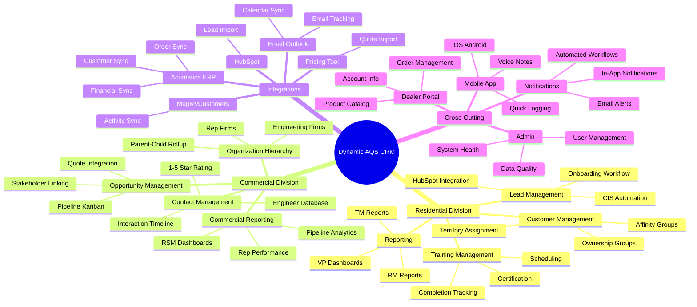

## Technology Stack

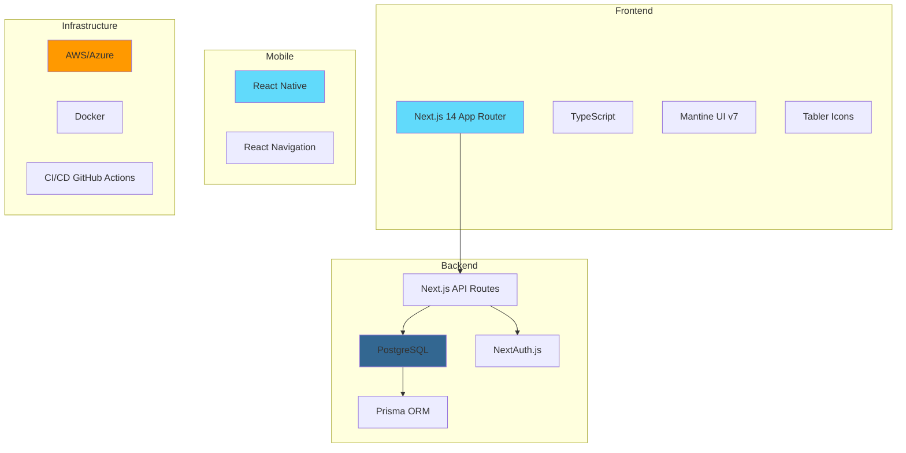

## Sprint Timeline Gantt

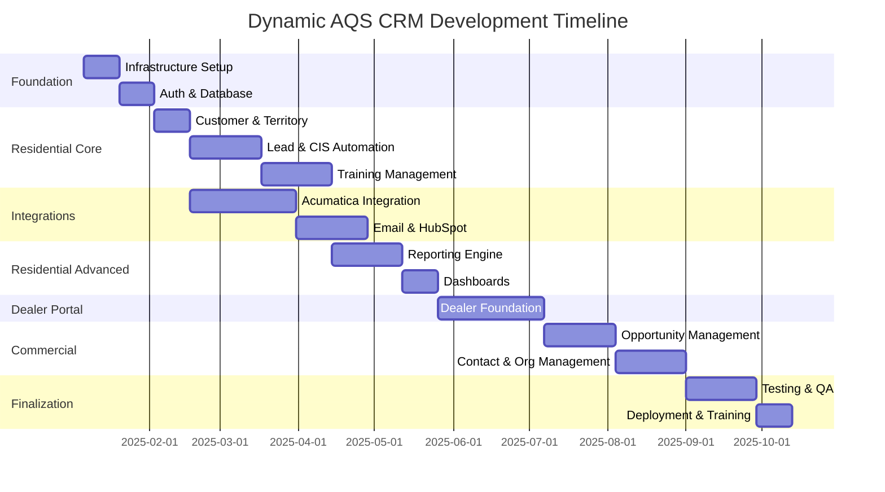

## User Access Hierarchy

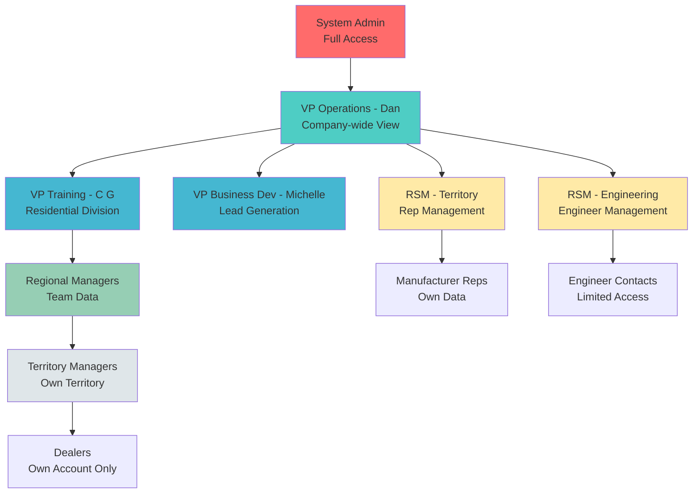

## Data Flow Architecture

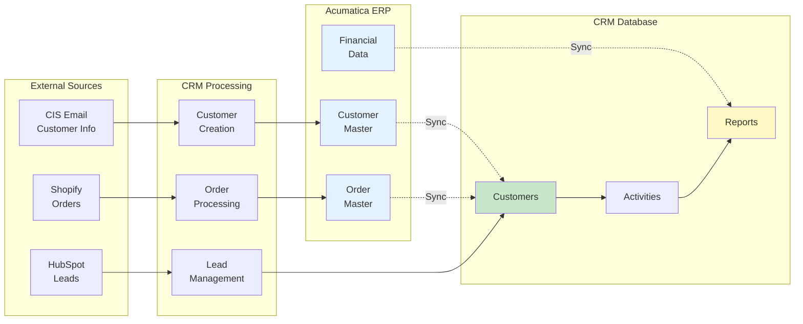

## Module Dependency Map

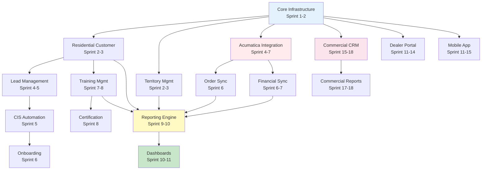

## Key Metrics Dashboard Concept

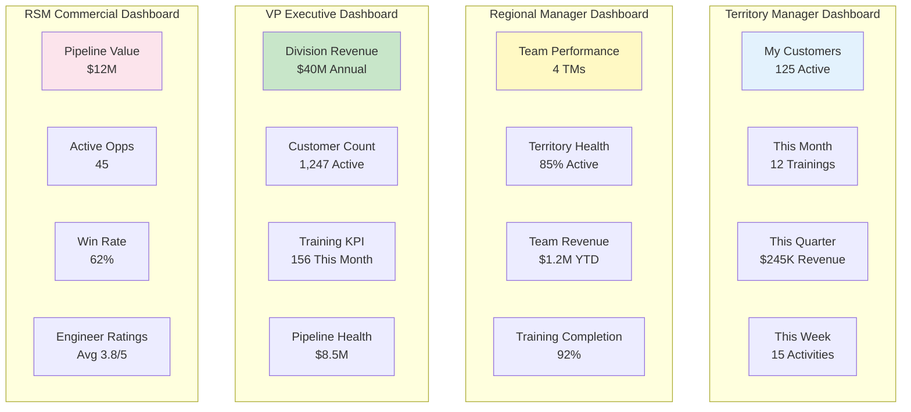

## Priority Matrix

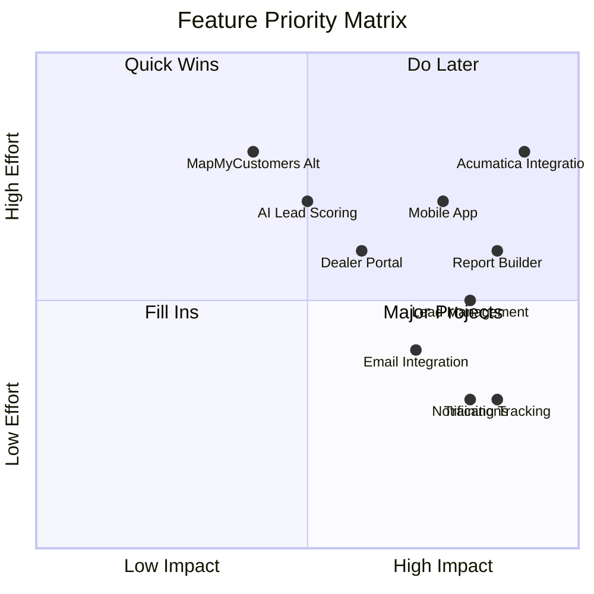

## Cost Savings Comparison

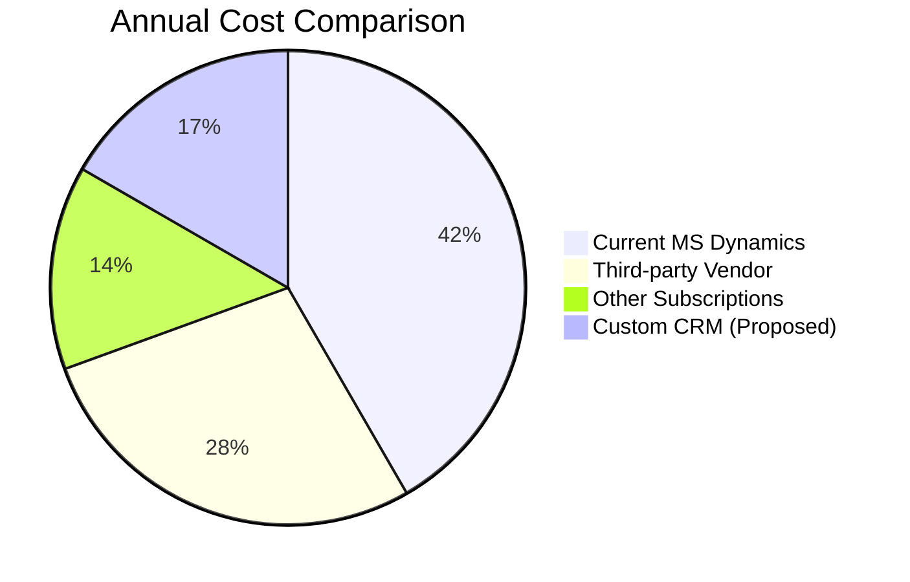

## Development Team Structure

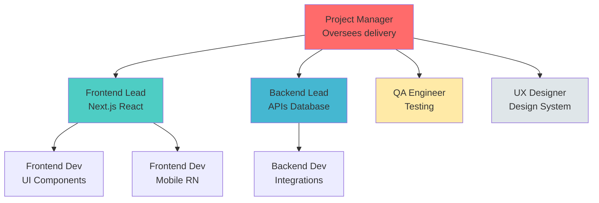

---

## 📊 Quick Stats

| Metric | Value |
|--------|-------|
| **Total Modules** | 15 |
| **Total Story Points** | 1,800+ |
| **Sprints** | 19 (38 weeks) |
| **User Personas** | 11 |
| **External Integrations** | 6 |
| **Expected Team Size** | 5-7 developers |
| **Estimated Cost Savings** | $115K-250K/year |
| **ROI Timeframe** | 6-12 months |

---

## 🎯 Success Criteria

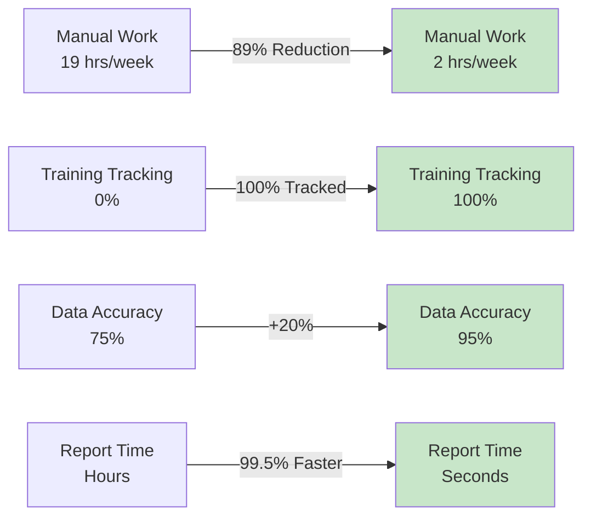

---

**For complete details, see:**
- `PROJECT_BREAKDOWN.csv` - Full task breakdown
- `USER_PERSONAS.md` - Detailed personas
- `WORKFLOW_DIAGRAMS.md` - Process flows
- `PROJECT_DOCUMENTATION_MASTER.md` - Master index
