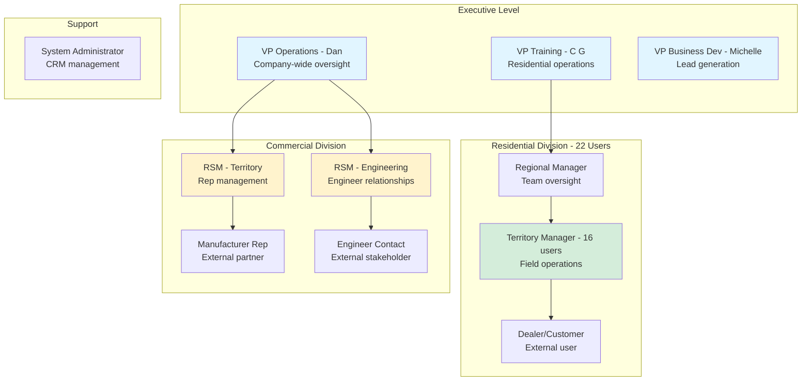
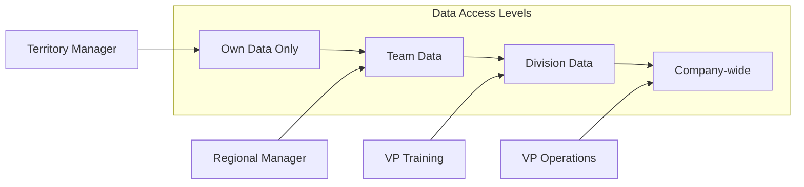
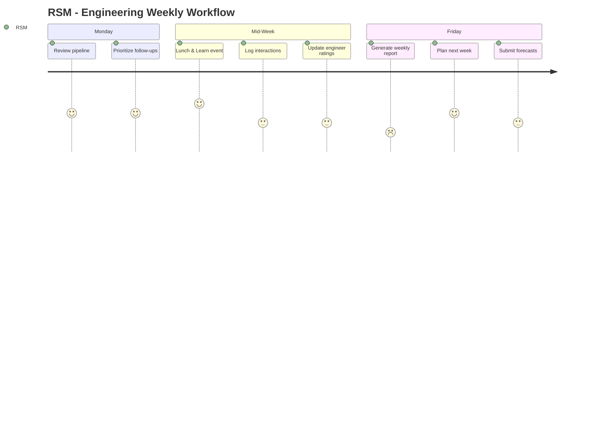

# User Personas - Dynamic AQS CRM

## Persona Map



## Detailed Personas

### 1. Territory Manager (TM) - Residential
**Count:** 16 users  
**Role:** Front-line field operations

**Goals:**
- Track customer trainings
- Log customer visits
- Manage relationships
- Hit sales targets

**Pain Points:**
- Cannot track trainings in current system
- Manual reporting takes too long
- Poor mobile experience

**Key Activities:**
- Customer visits (3-5 per day)
- Training sessions (2-3 per week)
- Order tracking
- Route planning

**System Needs:**
- Mobile app access
- Quick activity logging
- Training completion tracking
- Real-time order status

---

### 2. Regional Manager (RM) - Residential
**Count:** 5-6 users  
**Role:** Manages 3-4 Territory Managers

**Goals:**
- Monitor team performance
- Generate reports for executives
- Identify territory opportunities
- Coach TMs

**Pain Points:**
- Cannot get consolidated team reports
- Manual data aggregation
- No visibility into TM activities

**Key Activities:**
- Weekly team reviews
- Monthly performance reports
- Territory planning
- Coaching sessions

**System Needs:**
- Team dashboards
- Roll-up reporting
- Performance metrics
- Activity visibility

---

### 3. VP Training & Operations (C G) - Residential
**Count:** 1 user  
**Role:** Executive oversight

**Goals:**
- Answer "how many trainings last month?"
- Track KPIs across division
- Improve operational efficiency
- Report to ownership

**Pain Points:**
- Cannot run basic reports
- 19 hours/week manual work
- No visibility into field activities

**Key Activities:**
- Executive reporting
- Strategic planning
- Budget management
- Stakeholder updates

**System Needs:**
- Executive dashboards
- One-click reports
- Trend analysis
- Export capabilities

---

### 4. RSM - Territory (Commercial)
**Count:** 2-3 users  
**Role:** Manage manufacturer reps by geography

**Goals:**
- Win deals
- Manage rep relationships
- Track pipeline
- Meet quotas

**Pain Points:**
- Cannot track rep ratings
- No mobile note capture
- Manual reporting

**Key Activities:**
- Rep meetings
- Opportunity tracking
- Quote follow-up
- Territory planning

**System Needs:**
- Pipeline visibility
- Rep performance tracking
- Mobile voice-to-text
- Automated notifications

---

### 5. RSM - Engineering (Commercial)
**Count:** 2-3 users  
**Role:** Manage engineering firm relationships

**Goals:**
- Improve engineer ratings (1→5)
- Win specifications
- Build relationships
- Track interactions

**Pain Points:**
- Cannot track rating changes
- Manual contact management
- No lunch & learn tracking

**Key Activities:**
- Engineer meetings
- Lunch & learns
- Project tracking
- Relationship building

**System Needs:**
- Rating system (1-5)
- Interaction timeline
- Follow-up reminders
- Contact database

---

### 6. Dealer (Customer) - External
**Count:** 1000+ users  
**Role:** HVAC dealer ordering products

**Goals:**
- Easy product ordering
- Track shipments
- Access account info
- Find product specs

**Pain Points:**
- Current Shopify limitations
- Poor account visibility

**Key Activities:**
- Browse catalog
- Place orders
- Track deliveries
- View invoices

**System Needs:**
- Product catalog
- Shopping cart
- Order history
- Account statements

---

## Persona Access Matrix



## User Journey Maps

### Territory Manager Daily Journey
```mermaid
journey
    title Territory Manager Daily Workflow
    section Morning
      Check dashboard: 5: TM
      Review scheduled trainings: 4: TM
      Plan route for day: 5: TM
    section Field Work
      Customer visit #1: 5: TM
      Log visit notes (mobile): 3: TM
      Training session: 5: TM
      Mark training complete: 2: TM
      Customer visit #2: 5: TM
    section Evening
      Update CRM activities: 2: TM
      Check new orders: 4: TM
      Review tomorrow's schedule: 5: TM
```

### Commercial RSM Weekly Journey

