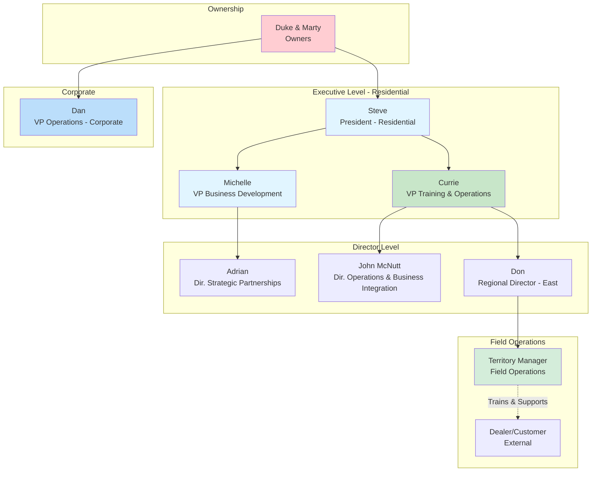
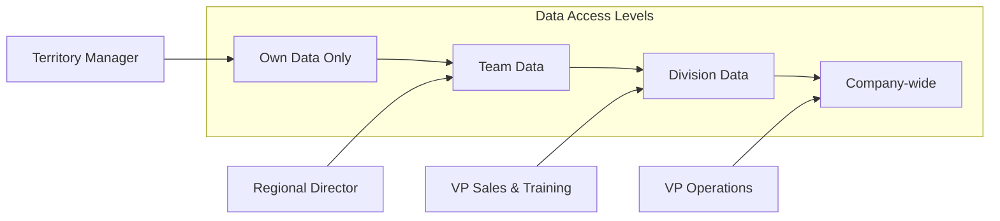
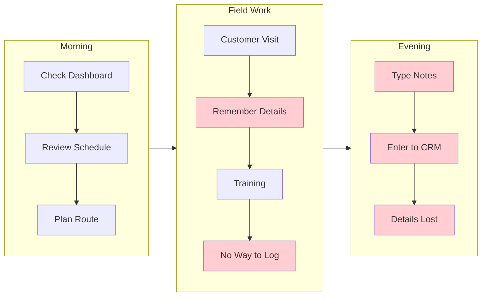
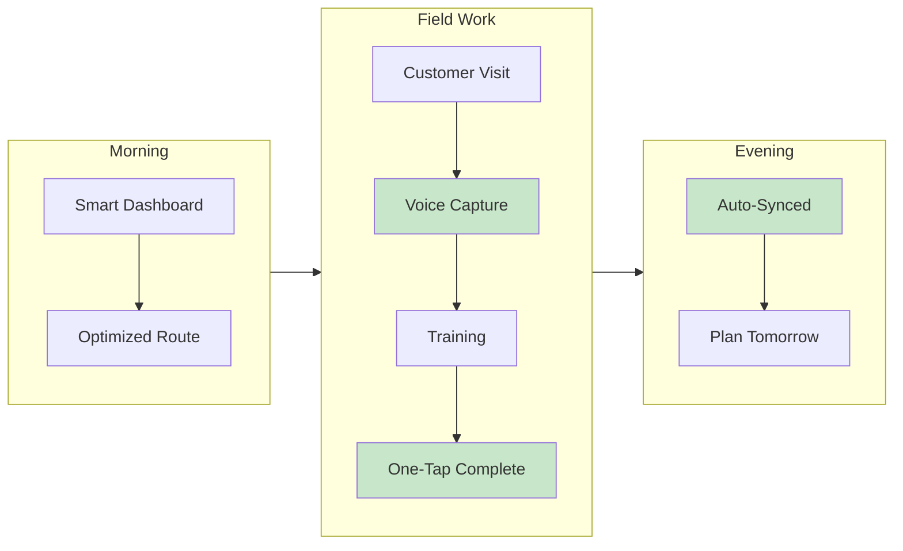

# User Personas - Dynamic AQS CRM

## Persona Summary

| Name | Title | Summary |
|------|-------|---------|
| **Duke & Marty** | Owners | Final decision makers for major investments |
| **Dan** | VP Operations (Corporate) | Company-wide IT strategy, oversees both Residential & Commercial |
| **Steve** | President - Residential | Oversees residential division |
| **Michelle** | VP Business Development | Leads generation and dealer onboarding |
| **Currie** | VP Training & Operations | Oversees TMs/RMs, needs training reports |
| **John McNutt** | Director of Operations & Business Integration | Operations and system integration |
| **Adrian** | Director of Strategic Partnerships | Partnership management |
| **Regional Director** | RD (e.g., Don - East) | Manages team of Territory Managers |
| **Territory Manager** | TM (16 people) | Front-line field operations, customer visits, trainings |
| **Dealer** | External Customer | HVAC dealers ordering products via portal |

---

## Organizational Structure

## Detailed Personas

> ⚠️ **Note:** Goals, pain points, and activities below are **inferred from discussions**. Specific numbers (e.g., "3-5 visits per day") are assumptions for planning purposes - actual metrics should be validated with each role.

### 1. Territory Manager (TM) - Residential
**Role:** Front-line field operations (16 people in this role)

**Goals:** *(Inferred from meetings)*
- Track customer trainings
- Log customer visits
- Manage relationships
- Hit sales targets

**Pain Points:** 
- Cannot track trainings in current system 
- Manual reporting takes too long 
- MapMyCustomers notes don't sync training completions 

**Key Activities:** *(Assumed - needs validation)*
- Customer visits (frequency TBD)
- Training sessions
- Order tracking
- Route planning

**System Needs:**
- Mobile app access
- Quick activity logging
- Training completion tracking
- Real-time order status

---

### 2. Regional Director (RD) - Residential
**Role:** Manages Territory Managers

**Goals:** *(Assumed - needs validation)*
- Monitor team performance
- Generate reports for executives
- Identify territory opportunities
- Coach TMs

**Pain Points:** *(Assumed - needs validation)*
- Cannot get consolidated team reports
- Manual data aggregation
- Limited visibility into TM activities

**Key Activities:** *(Assumed - needs validation)*
- Weekly team reviews
- Monthly performance reports
- Territory planning
- Coaching sessions

**System Needs:**
- Team dashboards
- Roll-up reporting
- Performance metrics
- Activity visibility

---

### 3. Currie - VP Training & Operations (Residential)
**Role:** Oversees residential sales and training, reports to Steve

**Goals:** 
- Answer "how many trainings last month?" without calling everyone
- Track KPIs across division
- Improve operational efficiency

**Pain Points:** 
- Cannot run basic reports  ("How many trainings last month?")
- Manual data aggregation across TMs 
- No visibility into field activities 
- MapMyCustomers doesn't sync trainings to CRM 

**Key Activities:** *(Assumed based on role)*
- Executive reporting
- Strategic planning
- Budget management
- Stakeholder updates

**System Needs:**
- Executive dashboards
- One-click reports ("How many trainings this quarter?")
- Trend analysis
- Unified training calendar visible to whole org

---

### 4. Dealer (Customer) - External
**Role:** HVAC dealer ordering products (Residential side)

**Goals:** *(Inferred from business context)*
- Easy product ordering (repeat orders especially)
- Track shipments in real-time
- Access account info, credit limits
- Find product specs

**Pain Points:** *(Inferred - Shopify issues mentioned)*
- Current Shopify portal is B2C focused, not ideal for B2B
- Account visibility could be improved
- Repeat ordering process could be streamlined

**Key Activities:** *(Assumed based on role)*
- Browse catalog
- Place orders (often repeating same products)
- Track deliveries
- View invoices and statements

**System Needs (Dealer Portal - Replaces Shopify):**
- Product catalog with comparison tool
- **Quick reorder** ("Order same as last time")
- Real-time shipment tracking (integrated with Acumatica)
- Account statements and credit limit visibility
- Assigned Territory Manager visible

---

## Persona Access Matrix

## User Journey Maps

> ⚠️ **IMPORTANT:** The following journey maps are **high-level assumptions** created for planning and visualization purposes. They are NOT based on direct user interviews or validated workflows.

### Territory Manager Daily Journey (High-Level Assumption)

#### Current State vs Target State

| Time | Current State (Pain Points) | Target State (Proposed) |
|------|----------------------------|------------------------|
| **Morning** | Check dashboard | Smart dashboard with alerts |
| | Review schedule manually | See AI-optimized route |
| | Plan route manually | One-click route start |
| **Field Work** | Customer visit ✓ | Customer visit ✓ |
| | Remember details for later 😟 | Voice note in car 🎤 |
| | Training session ✓ | Training session ✓ |
| | No way to mark complete ❌ | One-tap mark complete ✅ |
| **Evening** | Type notes manually (1-2 hrs) 😟 | Data already synced ✅ |
| | Enter data into CRM 😟 | Review tomorrow's prep |
| | Hope nothing forgotten 😟 | Time saved for family ✅ |

#### Visual Flow - Current State (High-Level Assumption)

#### Visual Flow - Target State (High-Level Assumption)

---

