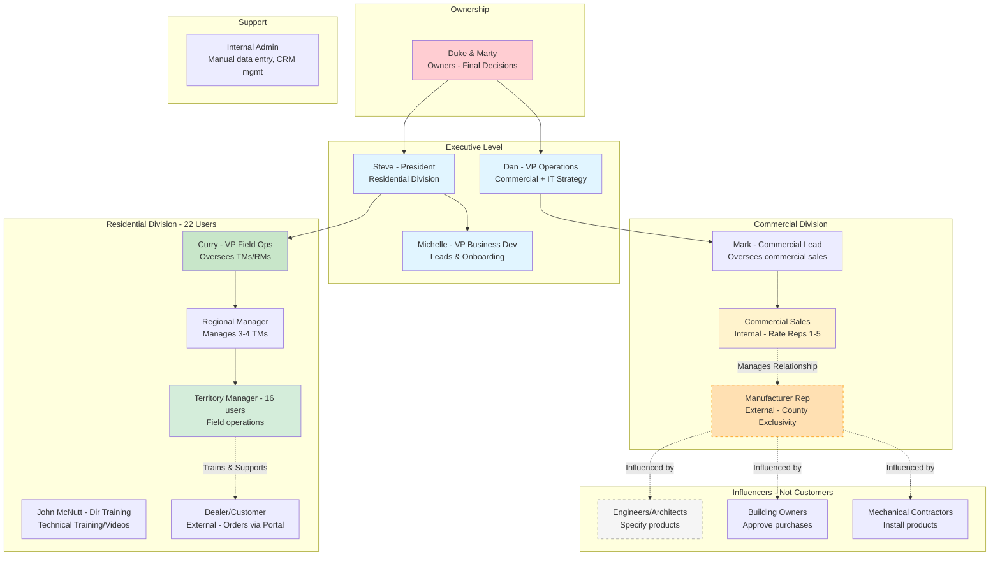
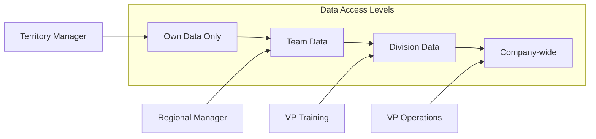
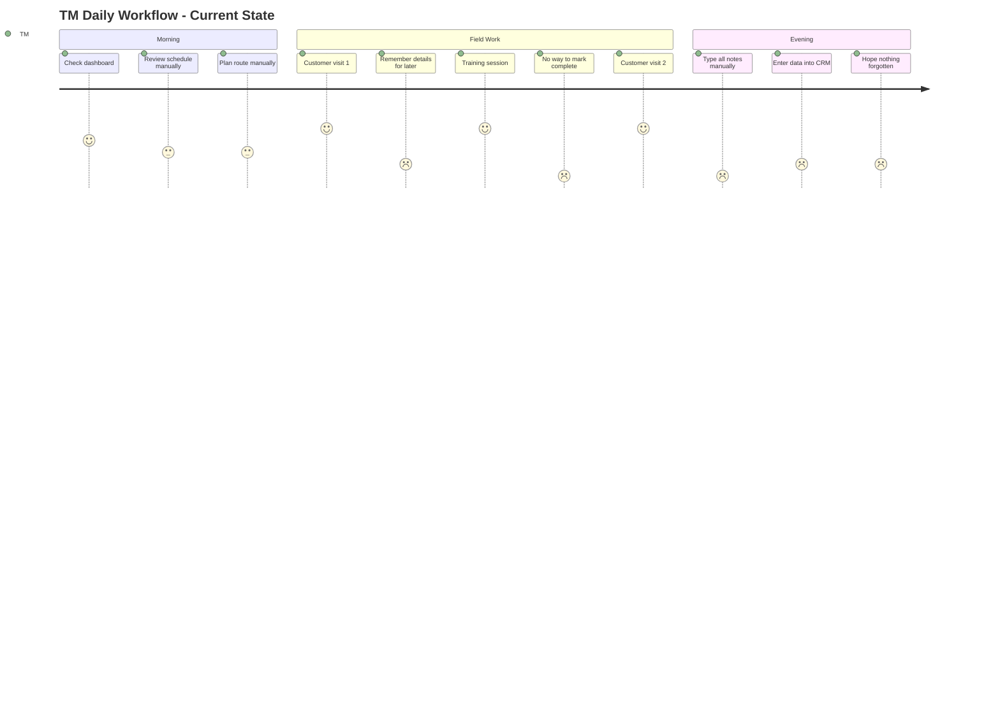
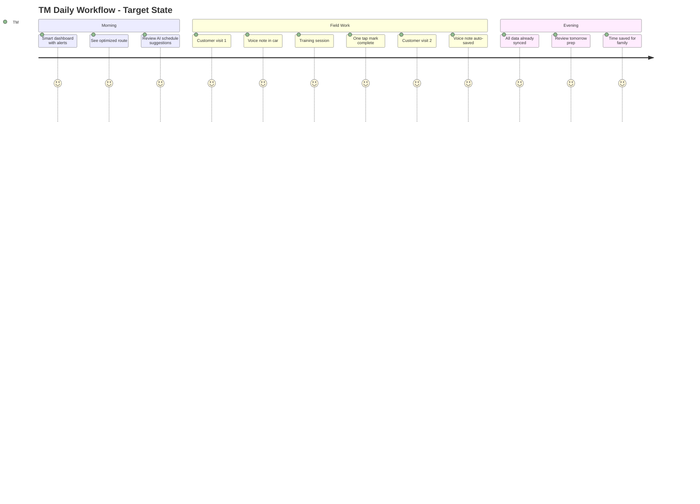
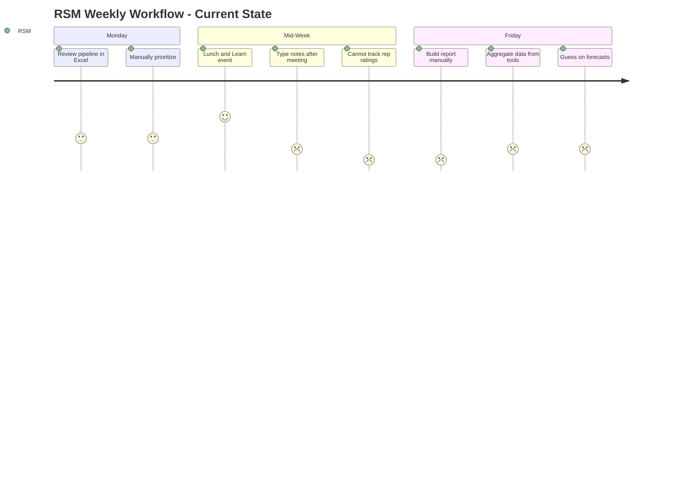
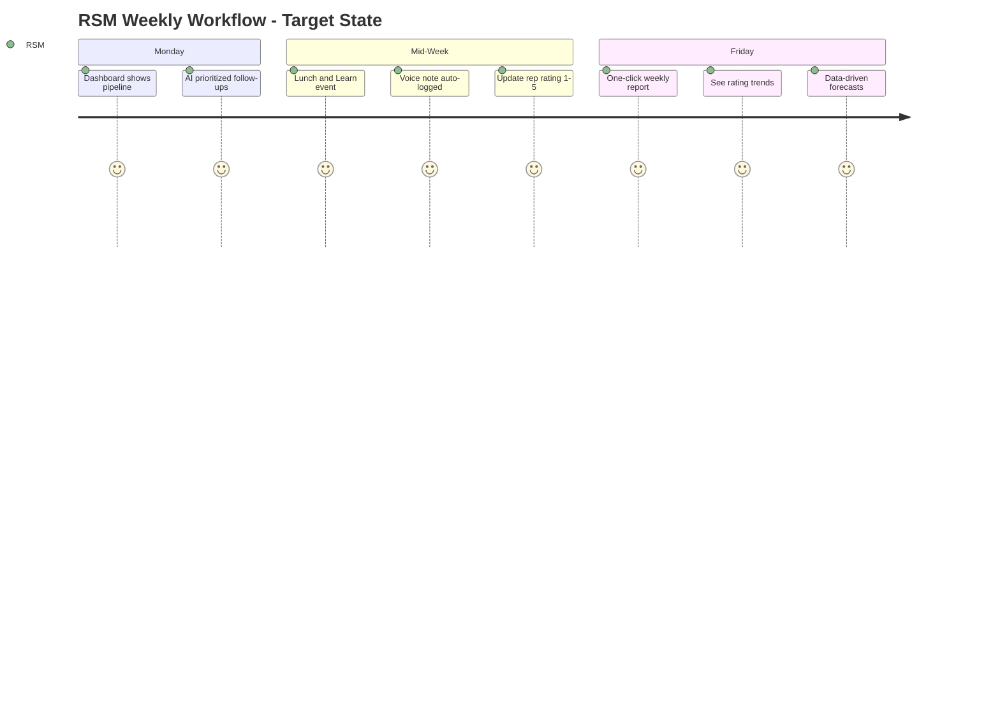

# User Personas - Dynamic AQS CRM

## Persona Map

## Detailed Personas

### 1. Territory Manager (TM) - Residential
**Count:** 16 users  
**Role:** Front-line field operations

**Goals:**
- Track customer trainings
- Log customer visits
- Manage relationships
- Hit sales targets

**Pain Points:**
- Cannot track trainings in current system
- Manual reporting takes too long
- Poor mobile experience

**Key Activities:**
- Customer visits (3-5 per day)
- Training sessions (2-3 per week)
- Order tracking
- Route planning

**System Needs:**
- Mobile app access
- Quick activity logging
- Training completion tracking
- Real-time order status

---

### 2. Regional Manager (RM) - Residential
**Count:** 5-6 users  
**Role:** Manages 3-4 Territory Managers

**Goals:**
- Monitor team performance
- Generate reports for executives
- Identify territory opportunities
- Coach TMs

**Pain Points:**
- Cannot get consolidated team reports
- Manual data aggregation
- No visibility into TM activities

**Key Activities:**
- Weekly team reviews
- Monthly performance reports
- Territory planning
- Coaching sessions

**System Needs:**
- Team dashboards
- Roll-up reporting
- Performance metrics
- Activity visibility

---

### 3. VP Field Operations (Curry) - Residential
**Count:** 1 user  
**Role:** Oversees residential field operations, reports to Steve (President)

**Direct Quote:**
> *"Right now, if I want to know how many trainings we did last month, I have to call each individual guy and ask 'How many trainings did you do?' It's like living in 1987."*

**Goals:**
- Answer "how many trainings last month?" without calling everyone
- Track KPIs across division
- Improve operational efficiency
- Report to ownership (Duke & Marty)

**Pain Points:**
- Cannot run basic reports
- Manual data aggregation across TMs
- No visibility into field activities
- Map My Customer doesn't sync trainings to CRM

**Key Activities:**
- Executive reporting
- Strategic planning
- Budget management
- Stakeholder updates to Steve, Duke, Marty

**System Needs:**
- Executive dashboards
- One-click reports ("How many trainings this quarter?")
- Trend analysis
- Unified training calendar visible to whole org

---

### 4. Commercial Sales Manager (CSM)
**Count:** 2-3 users  
**Role:** Manage manufacturer reps by county/geography

**Key Insight from Dan:**
> *"We sell our product to reps - manufacturers reps. They are our sales reps but they don't work for us. The people who influence the decision are the building owners, the engineers, architects, and mechanical contractors."*

**Goals:**
- Move rep ratings from 1 → 5 (core metric per ownership)
- Win deals through rep relationships
- Track complex multi-stakeholder projects
- Meet quotas

**Pain Points:**
- Cannot track rep ratings over time
- No mobile voice-to-text for quick notes after meetings
- Manual reporting
- Complex stakeholder relationships not mapped

**Key Activities:**
- Rep meetings (reps have county exclusivity)
- Opportunity tracking (hospitals, universities, data centers)
- Influencer relationship management (engineers, architects)
- Quote follow-up

**System Needs:**
- **1-5 Rating System** for reps (with history)
- Relationship mapping (Rep → Influencers → Projects)
- Mobile voice-to-text: *"I just met with Mark Santos at Gilbar..."* → auto-populates record
- Pipeline by territory/county

---

### 5. Manufacturer Rep (External Partner)
**Count:** Unknown (varies by region)  
**Role:** External sales partner with county exclusivity - NOT an employee

**Key Insight from Dan:**
> *"Job leads don't often come from marketing, websites or RSMs. They almost always come from manufacturer reps. It is the rep's job to know ALL of the projects in their territory and pitch our products. Their job is to bring us leads."*

> *"If we get a trade show lead in their territory, shame on the rep for not bringing us the lead. If it happens often, they are probably not the right rep for us."*

**Relationship:**
- Assigned **exclusive territory by county**
- Rated 1-5 by internal Commercial Sales team
- **THE lead source** for commercial projects (~95% of leads)
- Influenced by engineers, architects, building owners

**Rep's Job:**
- Know **ALL projects** in their territory
- Pitch Dynamic AQS products where appropriate
- Bring leads to Dynamic AQS
- Maintain relationships with influencers (engineers, architects)

**Performance Indicators:**
| Indicator | Good | Bad |
|-----------|------|-----|
| Leads brought | High volume, quality projects | Few or low-quality leads |
| Trade show leads in territory | Rare (they found it first) | Frequent = **"wrong rep for us"** |
| Project knowledge | Knows every project | Surprised by projects |
| Rating trend | Moving up (1→5) | Stagnant or declining |

**Pain Points (for Dynamic):**
- Reps have limited/no CRM access currently
- Internal team can't see rep activity
- Rating history not tracked
- No way to track "missed leads" (trade show leads in their territory)

**System Needs (for internal tracking):**
- **Rep Rating System** (1-5 with history)
- **Missed Lead Tracking** (trade show leads flagged to rep territory)
- County/territory assignment with map
- Interaction timeline
- Project attribution
- Parent-child relationships (rep → rep firm → national firm)

---

### 6. Dealer (Customer) - External
**Count:** 1000+ users  
**Role:** HVAC dealer ordering products (Residential side)

**Key Insight from Dan:**
> *"Shopify handles 60% of our residential sales, which means almost 50% of our total company-wide sales. It's a B2C platform that we've done our best to make work for our B2B customers. But it's not great."*

**Goals:**
- Easy product ordering (repeat orders especially)
- Track shipments in real-time
- Access account info, credit limits
- Find product specs

**Pain Points:**
- Shopify is B2C, not designed for B2B
- Poor account visibility
- Can't easily repeat previous orders
- No integration with training/support history

**Key Activities:**
- Browse catalog
- Place orders (often repeating same products)
- Track deliveries
- View invoices and statements

**System Needs (Dealer Portal - Replaces Shopify):**
- Product catalog with comparison tool
- **Quick reorder** ("Order same as last time")
- Real-time shipment tracking (integrated with Acumatica)
- Account statements and credit limit visibility
- Assigned Territory Manager visible

---

## Persona Access Matrix

## User Journey Maps

### Territory Manager Daily Journey (Current As-Is)
*Pain points: Manual note entry, no training tracking, end-of-day data entry*

### Territory Manager Daily Journey (Target State)
*With new CRM + Mobile App: Voice capture, auto-sync, real-time tracking*

---

### Commercial RSM Weekly Journey (Current As-Is)
*Pain points: Manual reporting, no rep rating history, fragmented data*

### Commercial RSM Weekly Journey (Target State)
*With new CRM: Real-time pipeline, rep rating system, auto-reports*

---

### Journey Improvement Summary

| Task | As-Is Score | Target Score | Improvement |
|------|-------------|--------------|-------------|
| **TM: Log visit notes** | 2 (manual typing) | 5 (voice capture) | +3 |
| **TM: Mark training complete** | 1 (no way) | 5 (one tap) | +4 |
| **TM: Evening data entry** | 1 (1-2 hours) | 5 (auto-synced) | +4 |
| **RSM: Track rep ratings** | 1 (cannot) | 5 (1-5 system) | +4 |
| **RSM: Weekly report** | 1 (manual build) | 5 (one-click) | +4 |
| **RSM: Forecasting** | 2 (guessing) | 5 (data-driven) | +3 |
