# Workflow Diagrams - Dynamic AQS CRM

### Core Pain Points to Solve
1. **"How many trainings did we do?"** — Currently requires calling each TM individually
2. **Manual data entry** — CIS forms, order tracking, activity logging
3. **Report accuracy** — Dynamics CRM doesn't match Acumatica numbers
4. **No unified calendar** — Can't see where trainers are scheduled
5. **Outlook not integrated** — Emails/calls not auto-tracked to CRM
6. **Shopify limitations** — B2C platform forced to work for B2B

### Key Integrations Required
| System | Integration Type | Priority |
|--------|-----------------|----------|
| **Acumatica ERP** | 2-way sync (financial data, orders, inventory) | Critical |
| **Outlook 365** | Graph API (emails, calendar, contacts auto-sync) | High |
| **HubSpot** | Lead sync (incoming leads → CRM) | High |
| **Widen/S3** | Asset management with single-source sync | Medium |

### Mobile App Requirements (Replace Map My Customer)
- Voice-to-text: *"I just met with Mark Santos..."* → auto-populates record
- Training scheduling and completion tracking
- Customer visit logging with photos
- Offline capability for field work
- Route planning / territory map

---

## Business Objectives & Value Proposition

### Strategic Business Objectives

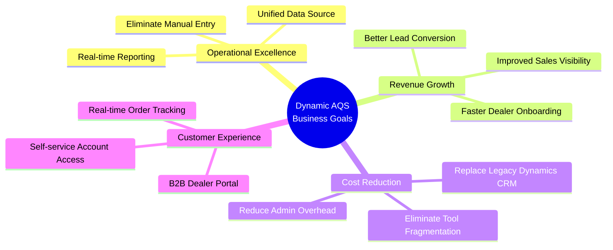

### Value Chain: Objectives → Features → Outcomes

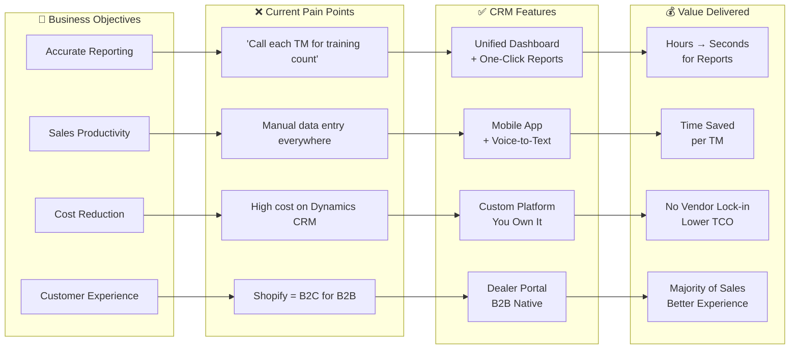

### Value-Driven Core Features

#### 1. Unified Reporting Dashboard
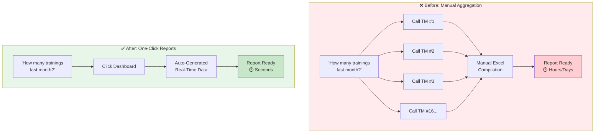

**Value:** Executive decisions made in seconds, not days.

---

#### 2. Acumatica Integration (Single Source of Truth)
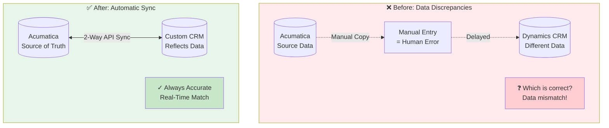

**Value:** Eliminate data discrepancies. Reports you can trust.

---

#### 3. Mobile App with Voice-to-Text

**Value:** Significant time saved per TM — more time for selling.

---

#### 4. Dealer Portal (Replaces Shopify)
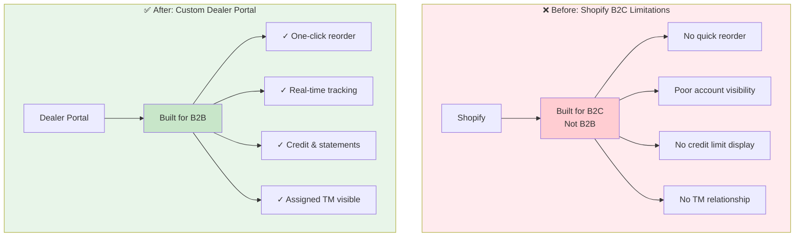

**Value:** Majority of residential sales get a better experience.

---

#### 5. Training Calendar & Tracking
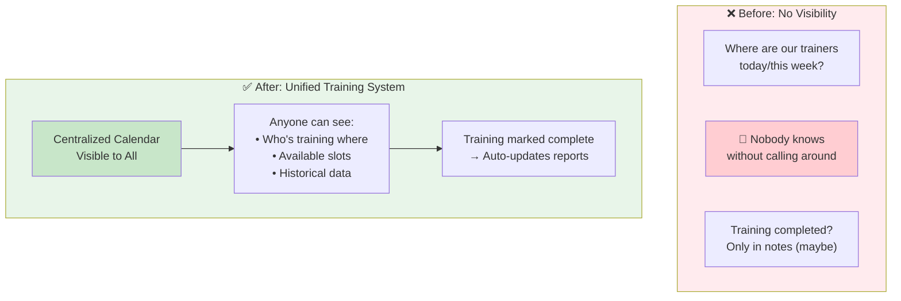

**Value:** "How many trainings this quarter?" answered instantly.

---

### ROI Summary

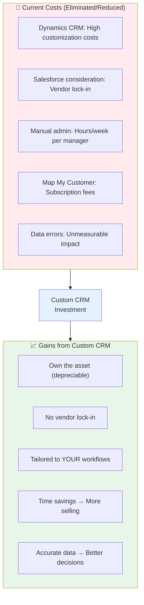

| Category | Before | After | Value |
|----------|--------|-------|-------|
| **Reporting Time** | Hours/Days | Seconds | Executive agility |
| **TM Admin Work** | Hours/day | Minutes | More time for selling |
| **Data Accuracy** | Variance issues | Real-time sync | Trust in numbers |
| **Tool Ownership** | Renting | Owning | Capitalize asset |
| **Dealer Experience** | B2C workaround | B2B native | Better experience |
| **Training Visibility** | None | Complete | Operational control |

---

## Residential Dealer Workflow - As-Is
*Current process highlighting manual data entry and disconnected systems.*

## Residential Training Workflow (Target State)

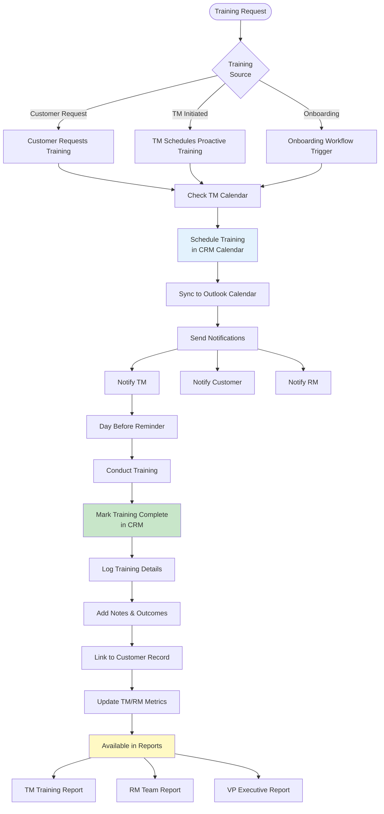

## Residential Order Workflow (Target State)

## System Integration Architecture - Current As-Is
*Current state showing siloed systems and manual data bridges.*

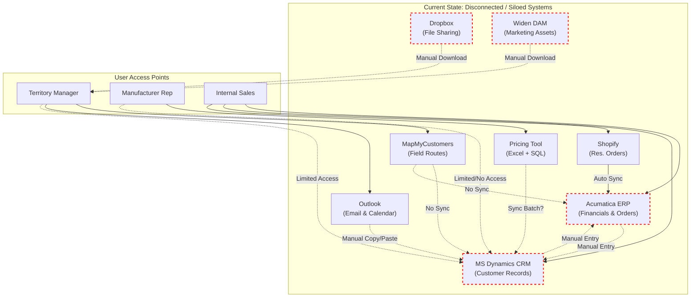

## System Integration Architecture (Target State)
*Unified platform with API-driven integrations and centralized data.*

**Asset Management Requirement (per Dan):** *"What Widen does is very unique. Being able to update a document in one place, and wherever it resides it updates."* — Target solution must preserve this single-source sync capability.

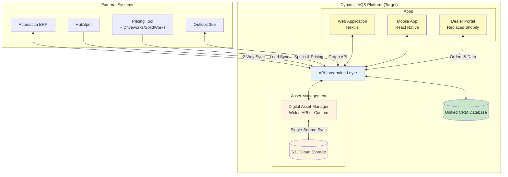

## Notification Flow (Target State)

---

## Consignment Tracking Workflow (Target State)
*Tracking consignment inventory at dealer locations with audit reconciliation.*

> **Current Pain Point:** Consignment tracking is done via shared Dropbox spreadsheet. Multiple users editing causes corruption, no visibility into audit status, and manual tracking of PO submissions for missing items.

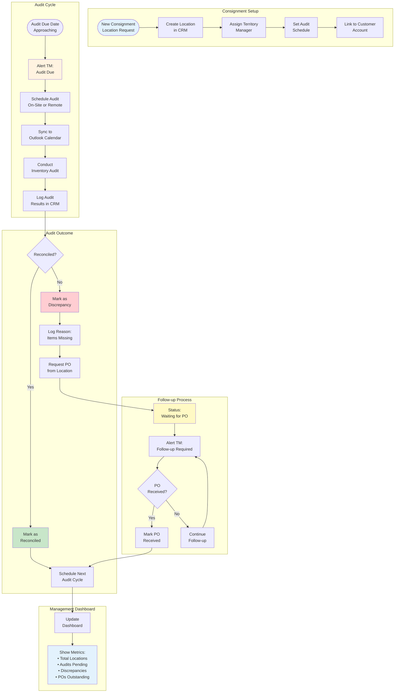

### Consignment Data Model

| Entity | Key Fields | Description |
|--------|------------|-------------|
| **Consignment Location** | Warehouse ID, TM, Customer ID, Inception Date | Physical location with consignment inventory |
| **Warehouse Manager** | Name, Email, Phone | Contact at the consignment location |
| **Reconciliation Cycle** | Audit Due, Status, Outcome, Activity | One audit period (quarterly) |
| **Audit Result** | Reconciled/Discrepancy, Reason, PO Status | Result of a single audit |

### Alert Triggers

| Trigger | Alert Type | Recipient |
|---------|------------|-----------|
| Audit due in 14 days | Reminder | TM |
| Audit due in 7 days | Warning | TM, RD |
| Audit overdue | Urgent | TM, RD |
| PO outstanding > 30 days | Follow-up | TM |
| Discrepancy rate high | Management | RD, VP |
