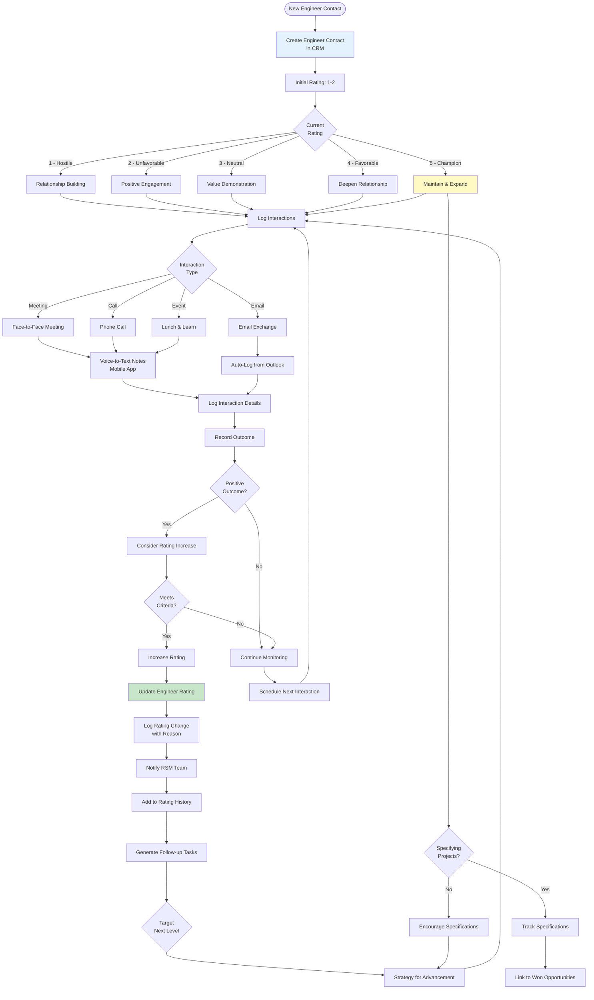

# Workflow Diagrams - Dynamic AQS CRM

## Residential Lead to Customer Workflow

## Residential Training Workflow

## Residential Order Workflow

## Commercial Opportunity Workflow

## Commercial Engineer Rating Workflow

## System Integration Architecture

## Notification Flow

