# Workflow Diagrams - Dynamic AQS CRM

## Key Requirements Summary (From Discovery Meetings)

### Strategic Decisions
| Decision | Details | Source |
|----------|---------|--------|
| **Unified CRM** | Single platform for both Residential & Commercial (preferred) | Dan, Curry |
| **Acumatica = Source of Truth** | CRM should *reflect* financial data, not *create* it | Curry |
| **Replace Shopify** | Custom Dealer Portal for B2B (Shopify is B2C) | Dan |
| **Map My Customer** | Either integrate OR build custom mobile app with same functionality | Curry |
| **Widen DAM** | Keep or replicate "update once, sync everywhere" capability | Dan |
| **Pricing Tool** | Keep separate (uses SolidWorks/Driveworks for specs) | Dan |
| **Decision Weight** | 70% functionality, 30% cost | Dan |

### Core Pain Points to Solve
1. **"How many trainings did we do?"** — Currently requires calling each TM individually
2. **Manual data entry** — CIS forms, order tracking, activity logging
3. **Report accuracy** — Dynamics CRM doesn't match Acumatica numbers
4. **No unified calendar** — Can't see where trainers are scheduled
5. **Outlook not integrated** — Emails/calls not auto-tracked to CRM
6. **Shopify limitations** — B2C platform forced to work for B2B
7. **Rep tracking** — No way to rate reps 1-5 or see history

### Key Integrations Required
| System | Integration Type | Priority |
|--------|-----------------|----------|
| **Acumatica ERP** | 2-way sync (financial data, orders, inventory) | Critical |
| **Outlook 365** | Graph API (emails, calendar, contacts auto-sync) | High |
| **HubSpot** | Lead sync (incoming leads → CRM) | High |
| **Pricing Tool** | Spec/quote import | Medium |
| **Widen/S3** | Asset management with single-source sync | Medium |

### Mobile App Requirements (Replace Map My Customer)
- Voice-to-text: *"I just met with Mark Santos..."* → auto-populates record
- Training scheduling and completion tracking
- Customer visit logging with photos
- Offline capability for field work
- Route planning / territory map

---

## Business Objectives & Value Proposition

### Strategic Business Objectives

### Value Chain: Objectives → Features → Outcomes

```mermaid
flowchart LR
    subgraph OBJ ["🎯 Business Objectives"]
        O1[Accurate Reporting]
        O2[Sales Productivity]
        O3[Cost Reduction]
        O4[Customer Experience]
    end
    
    subgraph PAIN ["❌ Current Pain Points"]
        P1["'Call each TM for training count'"]
        P2["Manual data entry everywhere"]
        P3["$600K+ on Dynamics CRM"]
        P4["Shopify = B2C for B2B"]
    end
    
    subgraph FEAT ["✅ CRM Features"]
        F1[Unified Dashboard<br/>+ One-Click Reports]
        F2[Mobile App<br/>+ Voice-to-Text]
        F3[Custom Platform<br/>You Own It]
        F4[Dealer Portal<br/>B2B Native]
    end
    
    subgraph VALUE ["💰 Value Delivered"]
        V1["Hours → Seconds<br/>for Reports"]
        V2["2+ Hours/Day Saved<br/>per TM"]
        V3["No Vendor Lock-in<br/>Lower TCO"]
        V4["60% of Sales<br/>Better Experience"]
    end
    
    O1 --> P1 --> F1 --> V1
    O2 --> P2 --> F2 --> V2
    O3 --> P3 --> F3 --> V3
    O4 --> P4 --> F4 --> V4
```

### Value-Driven Core Features

#### 1. Unified Reporting Dashboard

```mermaid
flowchart TB
    subgraph BEFORE ["❌ Before: Manual Aggregation"]
        Q1["'How many trainings<br/>last month?'"]
        Q1 --> Call1[Call TM #1]
        Q1 --> Call2[Call TM #2]
        Q1 --> Call3[Call TM #3]
        Q1 --> Call16[Call TM #16...]
        Call1 --> Excel[Manual Excel<br/>Compilation]
        Call2 --> Excel
        Call3 --> Excel
        Call16 --> Excel
        Excel --> Report[Report Ready<br/>⏱️ Hours/Days]
    end
    
    subgraph AFTER ["✅ After: One-Click Reports"]
        Q2["'How many trainings<br/>last month?'"]
        Q2 --> Click[Click Dashboard]
        Click --> Auto[Auto-Generated<br/>Real-Time Data]
        Auto --> Report2[Report Ready<br/>⏱️ Seconds]
    end
    
    style BEFORE fill:#ffebee
    style AFTER fill:#e8f5e9
    style Report fill:#ffcdd2
    style Report2 fill:#c8e6c9
```

**Value:** Executive decisions made in seconds, not days.

---

#### 2. Acumatica Integration (Single Source of Truth)

```mermaid
flowchart TB
    subgraph BEFORE ["❌ Before: Data Discrepancies"]
        ACU1[(Acumatica<br/>$1,234,567)]
        DYN1[(Dynamics CRM<br/>$1,198,432)]
        MANUAL["Manual Entry<br/>= Human Error"]
        ACU1 -.->|Manual Copy| MANUAL
        MANUAL -.->|Delayed| DYN1
        DIFF["❓ Which is correct?<br/>$36K difference!"]
    end
    
    subgraph AFTER ["✅ After: Automatic Sync"]
        ACU2[(Acumatica<br/>Source of Truth)]
        CRM2[(Custom CRM<br/>Reflects Data)]
        ACU2 <-->|2-Way API Sync| CRM2
        MATCH["✓ Always Accurate<br/>Real-Time Match"]
    end
    
    style BEFORE fill:#ffebee
    style AFTER fill:#e8f5e9
    style DIFF fill:#ffcdd2
    style MATCH fill:#c8e6c9
```

**Value:** Eliminate data discrepancies. Reports you can trust.

---

#### 3. Mobile App with Voice-to-Text

```mermaid
flowchart TB
    subgraph BEFORE ["❌ Before: End-of-Day Data Entry"]
        Visit1[Customer Visit 9am]
        Visit2[Customer Visit 11am]
        Visit3[Training 2pm]
        Visit4[Customer Visit 4pm]
        Evening[Evening: 1-2 hours<br/>typing notes into CRM]
        
        Visit1 --> Evening
        Visit2 --> Evening
        Visit3 --> Evening
        Visit4 --> Evening
        
        Forget["Details Forgotten<br/>Incomplete Records"]
    end
    
    subgraph AFTER ["✅ After: Voice Capture in Car"]
        V1[Customer Visit 9am]
        Voice1["🎤 'Just met with John at<br/>ABC HVAC, discussed...'"]
        Auto1[Auto-populates CRM]
        
        V1 --> Voice1 --> Auto1
        
        Save["2+ Hours Saved Daily<br/>Complete, Accurate Data"]
    end
    
    style BEFORE fill:#ffebee
    style AFTER fill:#e8f5e9
    style Forget fill:#ffcdd2
    style Save fill:#c8e6c9
```

**Value:** 2+ hours/day saved per TM × 16 TMs = 32+ hours/day recovered for selling.

---

#### 4. Rep Rating System (Commercial)

```mermaid
flowchart TB
    subgraph BEFORE ["❌ Before: No Visibility"]
        Rep1["Manufacturer Rep<br/>Performance?"]
        Unknown["🤷 No systematic<br/>tracking"]
        Random["Random follow-ups<br/>Missed opportunities"]
    end
    
    subgraph AFTER ["✅ After: 1-5 Rating System"]
        Rep2["Manufacturer Rep"]
        Rating["Rated 1-5<br/>with History"]
        Dashboard2["Dashboard shows:<br/>• Avg rating trend<br/>• Reps needing attention<br/>• Top performers"]
        Action["Targeted Actions:<br/>1-2: Improvement plan<br/>3-4: Nurture<br/>5: Leverage"]
        
        Rep2 --> Rating --> Dashboard2 --> Action
    end
    
    style BEFORE fill:#ffebee
    style AFTER fill:#e8f5e9
    style Unknown fill:#ffcdd2
    style Dashboard2 fill:#c8e6c9
```

**Value:** Core ownership metric now measurable. Move average rating up = more revenue.

---

#### 5. Dealer Portal (Replaces Shopify)

```mermaid
flowchart TB
    subgraph BEFORE ["❌ Before: Shopify B2C Limitations"]
        Shop[Shopify]
        B2C["Built for B2C<br/>Not B2B"]
        Pain1["No quick reorder"]
        Pain2["Poor account visibility"]
        Pain3["No credit limit display"]
        Pain4["No TM relationship"]
        
        Shop --> B2C
        B2C --> Pain1
        B2C --> Pain2
        B2C --> Pain3
        B2C --> Pain4
    end
    
    subgraph AFTER ["✅ After: Custom Dealer Portal"]
        Portal[Dealer Portal]
        B2B["Built for B2B"]
        Feat1["✓ One-click reorder"]
        Feat2["✓ Real-time tracking"]
        Feat3["✓ Credit & statements"]
        Feat4["✓ Assigned TM visible"]
        
        Portal --> B2B
        B2B --> Feat1
        B2B --> Feat2
        B2B --> Feat3
        B2B --> Feat4
    end
    
    style BEFORE fill:#ffebee
    style AFTER fill:#e8f5e9
    style B2C fill:#ffcdd2
    style B2B fill:#c8e6c9
```

**Value:** 60% of residential sales (≈50% company-wide) get a better experience.

---

#### 6. Training Calendar & Tracking

```mermaid
flowchart TB
    subgraph BEFORE ["❌ Before: No Visibility"]
        Q["Where are our trainers<br/>today/this week?"]
        Nobody["🤷 Nobody knows<br/>without calling around"]
        NoTrack["Training completed?<br/>Only in notes (maybe)"]
    end
    
    subgraph AFTER ["✅ After: Unified Training System"]
        Cal["Centralized Calendar<br/>Visible to All"]
        Sched["Anyone can see:<br/>• Who's training where<br/>• Available slots<br/>• Historical data"]
        Track["Training marked complete<br/>→ Auto-updates reports"]
        
        Cal --> Sched --> Track
    end
    
    style BEFORE fill:#ffebee
    style AFTER fill:#e8f5e9
    style Nobody fill:#ffcdd2
    style Cal fill:#c8e6c9
```

**Value:** "How many trainings this quarter?" answered instantly.

---

### ROI Summary

```mermaid
flowchart TB
    subgraph COSTS ["💸 Current Costs (Eliminated/Reduced)"]
        C1["Dynamics CRM: $600K+ customization"]
        C2["Salesforce consideration: $$$ + vendor lock-in"]
        C3["Manual admin: 19+ hrs/week per manager"]
        C4["Map My Customer: subscription fees"]
        C5["Data errors: unmeasurable lost revenue"]
    end
    
    subgraph GAINS ["📈 Gains from Custom CRM"]
        G1["Own the asset (depreciable)"]
        G2["No vendor lock-in"]
        G3["Tailored to YOUR workflows"]
        G4["Time savings → More selling"]
        G5["Accurate data → Better decisions"]
    end
    
    COSTS --> TRANSFORM["Custom CRM<br/>Investment"]
    TRANSFORM --> GAINS
    
    style COSTS fill:#ffebee
    style GAINS fill:#e8f5e9
    style TRANSFORM fill:#e3f2fd
```

| Category | Before | After | Value |
|----------|--------|-------|-------|
| **Reporting Time** | Hours/Days | Seconds | Executive agility |
| **TM Admin Work** | 2+ hrs/day | Minutes | 32+ hrs/day for selling |
| **Data Accuracy** | ±$36K variance | Real-time sync | Trust in numbers |
| **Tool Ownership** | Renting | Owning | Capitalize asset |
| **Dealer Experience** | B2C workaround | B2B native | 60% of sales improved |
| **Training Visibility** | None | Complete | Operational control |

---

## Residential Dealer Workflow - As-Is
*Current process highlighting manual data entry and disconnected systems.*

## Residential Training Workflow (Target State)

## Residential Order Workflow (Target State)

## Commercial Job Lead Workflow (Current As-Is)

> **Dan's Key Insight:** *"Job leads don't often come from marketing, websites or RSMs. They almost always come from manufacturer reps. We partner with reps giving them exclusivity by county. It is the rep's job to know all of the projects in their territory and pitch our products. Their job is to bring us leads."*

**Lead Source Hierarchy:**
| Source | Frequency | Implication |
|--------|-----------|-------------|
| **Manufacturer Rep** | ~95% | Expected — this is their job |
| **Trade Show (domestic)** | Rare | ⚠️ Rep failure — "shame on the rep" |
| **Trade Show (international)** | Rare | OK — no rep coverage |

```mermaid
flowchart TD
    %% Lead Sources
    subgraph Sources ["Lead Sources"]
        RepLead([Rep Brings Lead])
        TradeLead([Trade Show Lead])
        
        RepLead -->|Expected Path| Normal[Normal Flow]
        TradeLead --> Check{Domestic or<br/>International?}
        Check -->|Domestic| RepFail["⚠️ Rep Failure<br/>'Shame on the rep'"]
        Check -->|International| NoRep["No Rep Coverage<br/>Handle Internally"]
    end

    subgraph Rep ["Manufacturer Rep (THE Lead Source)"]
        RepStart([Knows ALL Projects<br/>in Territory])
        CreateLead[Create Lead in Pricing Tool]
        PrelimQuote[Build Preliminary Quote]
        FinalQuote[Refine Final Quote]
        RepFollowUp[Follow-up on Quote]
    end

    subgraph CSM ["Commercial Sales Manager"]
        Track[Track Pipeline / Funnel]
        Review[Review High Profile Jobs]
        EvalRep[Evaluate Rep Performance]
    end

    subgraph Admin ["Internal Sales / Admin"]
        Link[Link Accounts & Contacts in CRM]
        EnterPO[Enter PO into Acumatica]
        Release[Release for Production]
        PostShip[Post Shipment Info]
    end

    subgraph Systems ["Systems & Tools"]
        PricingTool["Dynamic Pricing Tool"]
        CRM[CRM System]
        Acumatica[Acumatica ERP]
    end

    %% Normal Rep Flow
    Normal --> RepStart
    RepStart --> CreateLead
    CreateLead --> PricingTool
    PricingTool --> PrelimQuote
    PrelimQuote --> FinalQuote
    
    %% Integration Points
    PricingTool -.->|Sync Prospect| CRM
    PricingTool -.->|Sync Quote| CRM
    
    %% Admin Actions
    CRM --> Link
    Link --> Track
    
    %% Won Job Flow
    FinalQuote --> RepFollowUp
    RepFollowUp --> PO{PO Received?}
    PO -->|Yes| EnterPO
    
    EnterPO --> Acumatica
    Acumatica --> Release
    Release --> PostShip
    
    %% Rep Failure Path
    RepFail --> EvalRep
    EvalRep --> RepCheck{Frequent<br/>Misses?}
    RepCheck -->|Yes| WrongRep["Probably Not<br/>Right Rep for Us"]
    RepCheck -->|No| Counsel[Counsel Rep]
    
    %% International handled internally
    NoRep --> Link
    
    %% Styling
    style RepFail stroke:#ff0000,stroke-width:2px,fill:#ffcdd2
    style WrongRep stroke:#ff0000,stroke-width:2px,fill:#ffcdd2
    style RepStart fill:#c8e6c9
    style Normal fill:#e8f5e9
```

**Key Points:**
- **RSMs don't generate leads** — they manage rep relationships and pipeline
- **Reps have exclusivity by county** — they should know EVERY project
- **Trade show lead in rep territory = Rep missed it** — performance issue
- **Frequent misses = Wrong rep** — consider replacement

## Manufacturer Rep Rating Workflow (Target State)
*Core commercial metric per ownership: Move reps from 1 → 5.*

> **Dan's Insight:** *"Our owner was talking about the metric being rating all of our manufacturer reps as a 1 through 5 and then that being the core metric that our sales people need to focus on — raising the average rating."*

> **On Missed Leads:** *"If we get a trade show lead in their territory, shame on the rep. If it happens often, they are probably not the right rep for us."*

**Rating Factors:**
| Factor | Positive Impact | Negative Impact |
|--------|-----------------|-----------------|
| **Leads Brought** | High volume, quality → Rating ↑ | Few leads → Rating ↓ |
| **Missed Leads** | N/A (none = expected) | Trade show lead in territory → Rating ↓ |
| **Project Knowledge** | Knows all projects → Rating ↑ | Surprised by projects → Rating ↓ |
| **Engagement** | Proactive communication → Rating ↑ | Hard to reach → Rating ↓ |

**Rating Scale:**
| Rating | Description | Action |
|--------|-------------|--------|
| 1 | Not Engaged | Requires outreach, consider replacement |
| 2 | Minimal Activity | Needs support, set improvement plan |
| 3 | Active | Monitor progress, regular check-ins |
| 4 | Strong Performer | Nurture, deepen relationship |
| 5 | Champion | Leverage for growth, reference partner |

**⚠️ Replacement Trigger:** Frequent missed leads = "probably not the right rep for us"

---

## Engineer/Influencer Relationship Workflow (Target State)
*Tracking relationships with engineers, architects, building owners who influence purchase decisions.*

## System Integration Architecture - Current As-Is
*Current state showing siloed systems and manual data bridges.*

## System Integration Architecture (Target State)
*Unified platform with API-driven integrations and centralized data.*

**Asset Management Requirement (per Dan):** *"What Widen does is very unique. Being able to update a document in one place, and wherever it resides it updates."* — Target solution must preserve this single-source sync capability.

## Notification Flow (Target State)

