# Current Residential Workflow (AS-IS)

This diagram shows the current residential workflow with all the manual processes and pain points.

```mermaid
flowchart TB
    subgraph LeadGen["Lead Generation (HubSpot)"]
        A[Website Leads]
        B[Trade Show Leads]
        C[Email Campaign Leads]
        A --> D[Leads in HubSpot]
        B --> D
        C --> D
    end
    
    subgraph Discovery["Discovery & Qualification"]
        D --> E[Discovery Call Scheduled]
        E --> F{Interested?}
        F -->|Yes| G[Send CIS Document]
        F -->|No| H[Archive Lead]
    end
    
    subgraph Manual["Manual Data Entry (19 hrs/week)"]
        G --> I[CIS Returned via Email]
        I --> J[⚠️ MANUAL: Type into Acumatica]
        I --> K[⚠️ MANUAL: Type into MS Dynamics]
        J --> L[Customer in ERP]
        K --> M[Customer in CRM]
    end
    
    subgraph Ops["Field Operations"]
        M --> N[Assign to Territory Manager]
        N --> O[TM uses MapMyCustomers]
        O --> P[Plan Routes]
        O --> Q[Voice Notes]
        Q --> R[❌ Notes sync to CRM only]
        R --> S[Cannot report on trainings]
    end
    
    subgraph Training["Training Management"]
        M --> T[Schedule Training]
        T --> U[Training Completed]
        U --> V[⚠️ MANUAL: Type in notes]
        V --> S
    end
    
    subgraph Orders["Order Processing"]
        L --> W[Customer Orders via Shopify]
        W --> X[Shopify → Acumatica Integration]
        X --> Y[Order in ERP]
        Y --> Z[⚠️ MANUAL: Enter order data in CRM]
    end
    
    subgraph Reporting["Reporting Chaos"]
        L --> AA[Acumatica Reports]
        M --> AB[MS Dynamics Reports]
        AC[QuickBooks 2024 Data] --> AD[⚠️ MANUAL: Excel Merge]
        AA --> AD
        AB --> AD
        AD --> AE[❌ Inconsistent Numbers]
        AE --> AF[Management Can't Make Decisions]
    end
    
    subgraph Notifications["No Automation"]
        Y --> AG[⚠️ MANUAL: Email Reply-All Threads]
        AG --> AH[Territory Manager]
        AG --> AI[Regional Manager]
        AG --> AJ[Training Team]
    end
    
    style J fill:#ff6b6b,stroke:#c92a2a,color:#fff
    style K fill:#ff6b6b,stroke:#c92a2a,color:#fff
    style R fill:#fa5252,stroke:#c92a2a,color:#fff
    style S fill:#fa5252,stroke:#c92a2a,color:#fff
    style V fill:#ff6b6b,stroke:#c92a2a,color:#fff
    style Z fill:#ff6b6b,stroke:#c92a2a,color:#fff
    style AD fill:#ff6b6b,stroke:#c92a2a,color:#fff
    style AE fill:#fa5252,stroke:#c92a2a,color:#fff
    style AF fill:#fa5252,stroke:#c92a2a,color:#fff
    style AG fill:#ff6b6b,stroke:#c92a2a,color:#fff
```

## Pain Points Legend
- 🔴 **⚠️ MANUAL**: Manual data entry required (error-prone, time-consuming)
- 🔴 **❌**: Missing functionality or broken process
- **19 hours/week**: Total time spent on manual CRM administration

## Key Issues

### 1. Manual Data Entry Everywhere
- CIS document → Type into Acumatica
- CIS document → Type into MS Dynamics  
- Orders → Type into CRM
- Trainings → Type into CRM notes

### 2. No Integration
- HubSpot ↔ CRM: No connection
- Acumatica ↔ CRM: No sync
- MapMyCustomers ↔ CRM: Only notes sync
- Shopify → Acumatica: Works
- Acumatica → CRM: No sync

### 3. No Training Tracking
- Trainings completed but can't report
- VP can't answer "How many trainings last month?"
- Only free-text notes available

### 4. Inconsistent Reporting
- Acumatica numbers ≠ MS Dynamics numbers
- Need manual Excel merging
- QuickBooks 2024 data manually added
- Management can't trust the data

### 5. No Automated Notifications
- Everything via email reply-all threads
- Manual task assignment
- No alerts for new orders, CIS submissions, etc.

### 6. Time Waste
- **1 hour/week**: Upload/maintain customer lists
- **10 hours/week**: Daily CRM uploads
- **4 hours/week**: Generate TM sales reports
- **3 hours/week**: Update PE groups
- **1 hour/week**: Monthly reports
- **= 19 hours/week total**
