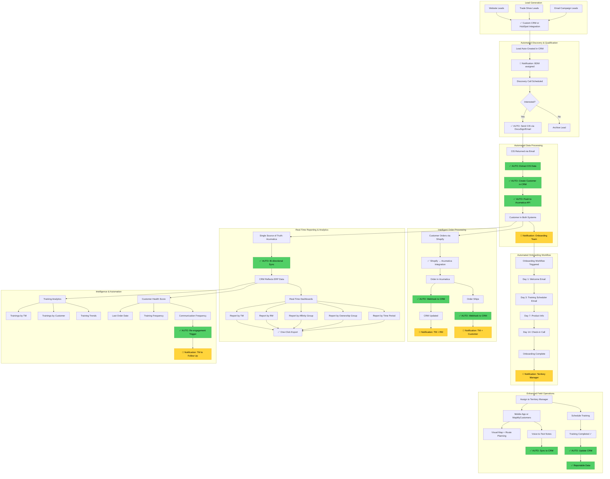

# Future Residential Workflow (TO-BE)

This diagram shows the proposed automated residential workflow with all integrations and automation.

## Automation Legend
- 🟢 **✅ AUTO**: Fully automated process
- 🟡 **🔔**: Automated notification sent
- **0 hours/week**: Manual CRM administration (from 19 hrs)

## Key Improvements

### 1. Zero Manual Data Entry
- CIS document → Auto-extracted and created in both systems
- Orders → Auto-synced from Acumatica
- Trainings → Auto-tracked and reportable
- Notes → Voice-to-text auto-synced

### 2. Full Integration
- ✅ Lead source → CRM (HubSpot or native)
- ✅ CRM ↔ Acumatica: Real-time API sync
- ✅ Mobile App ↔ CRM: Full sync
- ✅ Email ↔ CRM: Track all communications
- ✅ Shopify → Acumatica → CRM: Data pipeline

### 3. Training Tracking & Reporting
- ✅ Every training tracked
- ✅ VP can answer "How many trainings last month?" instantly
- ✅ Reports by TM, customer, time period
- ✅ Training trends and analytics

### 4. Consistent Reporting
- ✅ Single source of truth: Acumatica
- ✅ CRM reflects ERP data accurately
- ✅ No manual Excel merging
- ✅ Real-time dashboards
- ✅ One-click exports

### 5. Smart Notifications
- 🔔 New lead → BDM
- 🔔 CIS submitted → Onboarding team
- 🔔 Onboarding complete → TM
- 🔔 Order placed → TM + RM
- 🔔 Order shipped → TM + Customer
- 🔔 Re-engagement needed → TM
- 🔔 Training due → TM

### 6. Time Saved
- **19 hours/week → <2 hours/week**
- **Saved: ~17 hours/week = $44,200/year**
- Staff can focus on customers, not data entry

### 7. Intelligence Features
- Customer health scores
- Re-engagement automation
- Training analytics
- Multi-dimensional reporting
- Predictive insights

## Technical Architecture Highlights

### API Integrations
- **Acumatica REST API**: Real-time bidirectional sync
- **Email API** (Microsoft Graph): Track communications
- **Mobile API**: Custom or MapMyCustomers
- **Webhook listeners**: Real-time event processing

### Automation Engine
- Workflow automation (onboarding sequences)
- Event-triggered notifications
- Scheduled reports
- Data sync jobs

### Reporting Engine
- Real-time dashboards
- Custom report builder
- Scheduled reports
- Export to Excel/PDF/CSV

### Mobile Experience
- Native mobile app or MapMyCustomers integration
- Voice-to-text notes
- Offline mode
- Route planning
