# Future Residential Workflow (TO-BE)

This diagram shows the proposed automated residential workflow with all integrations and automation.

```mermaid
flowchart TB
    subgraph LeadGen["Lead Generation"]
        A[Website Leads]
        B[Trade Show Leads]
        C[Email Campaign Leads]
        A --> D[✅ Custom CRM or HubSpot Integration]
        B --> D
        C --> D
    end
    
    subgraph AutoDiscovery["Automated Discovery & Qualification"]
        D --> E[Lead Auto-Created in CRM]
        E --> F[🔔 Notification: BDM assigned]
        F --> G[Discovery Call Scheduled]
        G --> H{Interested?}
        H -->|Yes| I[✅ AUTO: Send CIS via DocuSign/Email]
        H -->|No| J[Archive Lead]
    end
    
    subgraph Automated["Automated Data Processing"]
        I --> K[CIS Returned via Email]
        K --> L[✅ AUTO: Extract CIS Data]
        L --> M[✅ AUTO: Create Customer in CRM]
        M --> N[✅ AUTO: Push to Acumatica API]
        N --> O[Customer in Both Systems]
        O --> P[🔔 Notification: Onboarding Team]
    end
    
    subgraph AutoOnboard["Automated Onboarding Workflow"]
        P --> Q[Onboarding Workflow Triggered]
        Q --> R[Day 1: Welcome Email]
        R --> S[Day 3: Training Scheduler Email]
        S --> T[Day 7: Product Info]
        T --> U[Day 14: Check-in Call]
        U --> V[Onboarding Complete]
        V --> W[🔔 Notification: Territory Manager]
    end
    
    subgraph FieldOps["Enhanced Field Operations"]
        W --> X[Assign to Territory Manager]
        X --> Y[Mobile App or MapMyCustomers]
        Y --> Z[Visual Map + Route Planning]
        Y --> AA[Voice-to-Text Notes]
        AA --> AB[✅ AUTO: Sync to CRM]
        X --> AC[Schedule Training]
        AC --> AD[Training Completed ✓]
        AD --> AE[✅ AUTO: Update CRM]
        AE --> AF[✅ Reportable Data]
    end
    
    subgraph SmartOrders["Intelligent Order Processing"]
        O --> AG[Customer Orders via Shopify]
        AG --> AH[✅ Shopify → Acumatica Integration]
        AH --> AI[Order in Acumatica]
        AI --> AJ[✅ AUTO: Webhook to CRM]
        AJ --> AK[CRM Updated]
        AK --> AL[🔔 Notification: TM + RM]
        AI --> AM[Order Ships]
        AM --> AN[✅ AUTO: Webhook to CRM]
        AN --> AO[🔔 Notification: TM + Customer]
    end
    
    subgraph SmartReporting["Real-Time Reporting & Analytics"]
        O --> AP[Single Source of Truth: Acumatica]
        AP --> AQ[✅ AUTO: Bi-directional Sync]
        AQ --> AR[CRM Reflects ERP Data]
        AR --> AS[Real-Time Dashboards]
        AS --> AT[Report by TM]
        AS --> AU[Report by RM]
        AS --> AV[Report by Affinity Group]
        AS --> AW[Report by Ownership Group]
        AS --> AX[Report by Time Period]
        AT --> AY[✅ One-Click Export]
        AU --> AY
        AV --> AY
        AW --> AY
        AX --> AY
    end
    
    subgraph Intelligence["Intelligence & Automation"]
        AR --> AZ[Training Analytics]
        AZ --> BA[Trainings by TM]
        AZ --> BB[Trainings by Customer]
        AZ --> BC[Training Trends]
        
        AR --> BD[Customer Health Score]
        BD --> BE[Last Order Date]
        BD --> BF[Training Frequency]
        BD --> BG[Communication Frequency]
        
        BG --> BH[✅ AUTO: Re-engagement Trigger]
        BH --> BI[🔔 Notification: TM to Follow Up]
    end
    
    style L fill:#51cf66,stroke:#2f9e44,color:#000
    style M fill:#51cf66,stroke:#2f9e44,color:#000
    style N fill:#51cf66,stroke:#2f9e44,color:#000
    style P fill:#ffd43b,stroke:#f59f00,color:#000
    style W fill:#ffd43b,stroke:#f59f00,color:#000
    style AB fill:#51cf66,stroke:#2f9e44,color:#000
    style AE fill:#51cf66,stroke:#2f9e44,color:#000
    style AF fill:#51cf66,stroke:#2f9e44,color:#000
    style AJ fill:#51cf66,stroke:#2f9e44,color:#000
    style AL fill:#ffd43b,stroke:#f59f00,color:#000
    style AN fill:#51cf66,stroke:#2f9e44,color:#000
    style AO fill:#ffd43b,stroke:#f59f00,color:#000
    style AQ fill:#51cf66,stroke:#2f9e44,color:#000
    style BH fill:#51cf66,stroke:#2f9e44,color:#000
    style BI fill:#ffd43b,stroke:#f59f00,color:#000
```

## Automation Legend
- 🟢 **✅ AUTO**: Fully automated process
- 🟡 **🔔**: Automated notification sent
- **0 hours/week**: Manual CRM administration (from 19 hrs)

## Key Improvements

### 1. Zero Manual Data Entry
- CIS document → Auto-extracted and created in both systems
- Orders → Auto-synced from Acumatica
- Trainings → Auto-tracked and reportable
- Notes → Voice-to-text auto-synced

### 2. Full Integration
- ✅ Lead source → CRM (HubSpot or native)
- ✅ CRM ↔ Acumatica: Real-time API sync
- ✅ Mobile App ↔ CRM: Full sync
- ✅ Email ↔ CRM: Track all communications
- ✅ Shopify → Acumatica → CRM: Data pipeline

### 3. Training Tracking & Reporting
- ✅ Every training tracked
- ✅ VP can answer "How many trainings last month?" instantly
- ✅ Reports by TM, customer, time period
- ✅ Training trends and analytics

### 4. Consistent Reporting
- ✅ Single source of truth: Acumatica
- ✅ CRM reflects ERP data accurately
- ✅ No manual Excel merging
- ✅ Real-time dashboards
- ✅ One-click exports

### 5. Smart Notifications
- 🔔 New lead → BDM
- 🔔 CIS submitted → Onboarding team
- 🔔 Onboarding complete → TM
- 🔔 Order placed → TM + RM
- 🔔 Order shipped → TM + Customer
- 🔔 Re-engagement needed → TM
- 🔔 Training due → TM

### 6. Time Saved
- **19 hours/week → <2 hours/week**
- **Saved: ~17 hours/week = $44,200/year**
- Staff can focus on customers, not data entry

### 7. Intelligence Features
- Customer health scores
- Re-engagement automation
- Training analytics
- Multi-dimensional reporting
- Predictive insights

## Technical Architecture Highlights

### API Integrations
- **Acumatica REST API**: Real-time bidirectional sync
- **Email API** (Microsoft Graph): Track communications
- **Mobile API**: Custom or MapMyCustomers
- **Webhook listeners**: Real-time event processing

### Automation Engine
- Workflow automation (onboarding sequences)
- Event-triggered notifications
- Scheduled reports
- Data sync jobs

### Reporting Engine
- Real-time dashboards
- Custom report builder
- Scheduled reports
- Export to Excel/PDF/CSV

### Mobile Experience
- Native mobile app or MapMyCustomers integration
- Voice-to-text notes
- Offline mode
- Route planning
