# Current Commercial Workflow (AS-IS)

This diagram shows the current commercial workflow with manual processes and limited tracking.

```mermaid
flowchart TB
    subgraph LeadGen["Lead Generation"]
        A[ASHRAE Booth]
        B[Website Inquiries]
        C[Referrals]
        A --> D[⚠️ MANUAL: Import to CRM]
        B --> D
        C --> D
        D --> E[⚠️ MANUAL: Assign to RSM]
    end
    
    subgraph Contacts["Contact Management"]
        E --> F[RSM Meets Engineers]
        F --> G[Lunch & Learn Session]
        G --> H[10 Engineers in Room]
        H --> I[⚠️ MANUAL: Type notes after]
        I --> J[❌ No way to rate engineers]
        J --> K[❌ Can't track relationship strength]
    end
    
    subgraph Opp["Opportunity Creation"]
        E --> L[New Project Identified]
        L --> M[⚠️ MANUAL: Create in CRM]
        M --> N[⚠️ MANUAL: Add all players]
        N --> O[Building Owner]
        N --> P[Architect]
        N --> Q[Engineering Firm]
        N --> R[Mechanical Contractor]
        N --> S[Manufacturer Rep]
    end
    
    subgraph Pricing["Pricing & Quoting"]
        M --> T[RSM needs quote]
        T --> U[Use Excel Pricing Tool]
        U --> V[VBA + Azure SQL DB]
        V --> W[Generate Quote]
        W --> X[⚠️ MANUAL: Enter quote in CRM]
        X --> Y[❌ Often quote # mismatch]
    end
    
    subgraph Sales["Sales Process"]
        X --> Z[Prospect Stage]
        Z --> AA[Preliminary Quote]
        AA --> AB{Customer Decision}
        AB -->|Revise| U
        AB -->|Accept| AC[Final Quote]
        AC --> AD[PO Received]
        AD --> AE[⚠️ MANUAL: Enter PO in Acumatica]
        AE --> AF[⚠️ MANUAL: Update CRM]
    end
    
    subgraph Production["Production & Shipping"]
        AE --> AG[Released for Production]
        AG --> AH[⚠️ MANUAL: Update CRM]
        AG --> AI[Expected Ship Date Set]
        AI --> AJ[⚠️ MANUAL: Update CRM]
        AI --> AK[Order Ships]
        AK --> AL[⚠️ MANUAL: Update CRM]
        AL --> AM[⚠️ MANUAL: Email RSMs]
        AL --> AN[⚠️ MANUAL: Email Holly]
    end
    
    subgraph Reporting["Reporting Challenges"]
        AF --> AO[Want: Report by Engineer]
        AF --> AP[Want: Report by Rep Firm]
        AF --> AQ[Want: Report by Market Segment]
        AO --> AR[❌ Parent/Child not working]
        AP --> AR
        AQ --> AR
        AR --> AS[⚠️ MANUAL: Excel Exports]
        AS --> AT[⚠️ MANUAL: Pivot Tables]
        AT --> AU[❌ Hours of work for one report]
    end
    
    subgraph Follow["Follow-up"]
        AL --> AV[Project Complete]
        AV --> AW[❌ No automated follow-up]
        AW --> AX[High-profile university?]
        AX -->|Yes| AY[⚠️ MANUAL: Calendar reminder]
        AY --> AZ[Check back in 6 months]
        AZ --> BA[❌ Often forgotten]
    end
    
    style D fill:#ff6b6b,stroke:#c92a2a,color:#fff
    style E fill:#ff6b6b,stroke:#c92a2a,color:#fff
    style I fill:#ff6b6b,stroke:#c92a2a,color:#fff
    style J fill:#fa5252,stroke:#c92a2a,color:#fff
    style K fill:#fa5252,stroke:#c92a2a,color:#fff
    style M fill:#ff6b6b,stroke:#c92a2a,color:#fff
    style N fill:#ff6b6b,stroke:#c92a2a,color:#fff
    style X fill:#ff6b6b,stroke:#c92a2a,color:#fff
    style Y fill:#fa5252,stroke:#c92a2a,color:#fff
    style AE fill:#ff6b6b,stroke:#c92a2a,color:#fff
    style AF fill:#ff6b6b,stroke:#c92a2a,color:#fff
    style AH fill:#ff6b6b,stroke:#c92a2a,color:#fff
    style AJ fill:#ff6b6b,stroke:#c92a2a,color:#fff
    style AL fill:#ff6b6b,stroke:#c92a2a,color:#fff
    style AM fill:#ff6b6b,stroke:#c92a2a,color:#fff
    style AN fill:#ff6b6b,stroke:#c92a2a,color:#fff
    style AR fill:#fa5252,stroke:#c92a2a,color:#fff
    style AS fill:#ff6b6b,stroke:#c92a2a,color:#fff
    style AT fill:#ff6b6b,stroke:#c92a2a,color:#fff
    style AU fill:#fa5252,stroke:#c92a2a,color:#fff
    style AW fill:#fa5252,stroke:#c92a2a,color:#fff
    style AY fill:#ff6b6b,stroke:#c92a2a,color:#fff
    style BA fill:#fa5252,stroke:#c92a2a,color:#fff
```

## Pain Points Legend
- 🔴 **⚠️ MANUAL**: Manual data entry or process
- 🔴 **❌**: Missing functionality or broken process

## Key Issues

### 1. No Contact Intelligence
- Meet 10 engineers at lunch & learn
- Can't quickly capture their info
- Can't rate their relationship (1-5 scale)
- Can't track who to focus on
- No voice-to-text note capture

### 2. Disconnected Pricing Tool
- Excel with VBA + Azure SQL database
- Quote generated separately
- Manual entry to CRM
- Quote numbers often mismatch
- No automatic sync

### 3. No ERP ↔ CRM Sync
- PO entered in Acumatica → Manual CRM update
- Released for production → Manual CRM update
- ESD set → Manual CRM update
- Shipped → Manual CRM update
- **Every stage requires manual work**

### 4. No Automated Notifications
- PO received → Manual email to RSMs
- ESD set → Manual email to RSMs
- Shipped → Manual email to RSMs + Holly
- No tracking of who was notified
- Reply-all email threads

### 5. Parent/Child Reporting Broken
- Engineering firms have offices worldwide
- Rep firms have multiple locations
- Want to roll up all opportunities
- Current CRM doesn't handle this well
- **Hours spent creating manual Excel reports**

### 6. No Follow-up Automation
- High-profile projects (universities) need follow-up
- Should check back at 6 months, 1 year, 3 years
- Often forgotten
- Manual calendar entries
- Lost opportunities

### 7. No Market Segmentation
- Want to report by market (Healthcare, Cannabis, University)
- Want to see trends
- Want to identify best markets
- **Can't do this easily in current CRM**

## Quote → PO Problem

**Current Issue:**
- More quotes than POs (obviously)
- All quotes pushed to ERP
- ERP cluttered with quotes that never convert
- Want: Keep quotes in CRM until PO, then push to ERP

**Needs:**
- Quote stage in CRM (not in ERP)
- Only push to ERP when PO received
- Track quote → PO conversion rate
