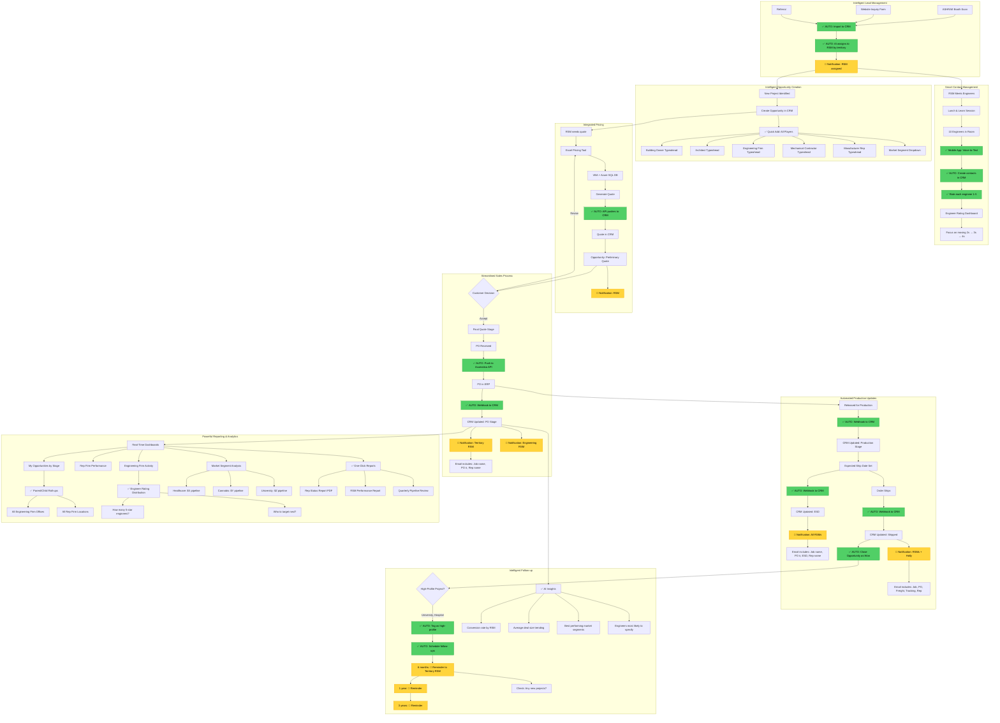

# Future Commercial Workflow (TO-BE)

This diagram shows the proposed intelligent commercial workflow with full automation and contact intelligence.

## Automation Legend
- 🟢 **✅ AUTO**: Fully automated process
- 🟡 **🔔**: Automated notification sent
- 🔵 **✅ AI**: AI-powered intelligence

## Key Improvements

### 1. Contact Intelligence System
- ✅ Voice-to-text contact capture (mobile app)
- ✅ Quick add 10 engineers from one meeting
- ✅ Rate each contact 1-5:
  - **1**: Doesn't like Dynamic
  - **2**: Just met
  - **3**: Presented to
  - **4**: Has specified
  - **5**: Specifies a lot
- ✅ Dashboard: "Who should I focus on?"
- ✅ Task: Move contacts up the rating scale

### 2. Pricing Tool Integration
- ✅ Excel pricing tool generates quote
- ✅ API automatically pushes to CRM
- ✅ Quote number consistency
- ✅ No manual entry
- ✅ Opportunity auto-updated

### 3. Full ERP Integration
- ✅ Quote in CRM (NOT in ERP yet)
- ✅ PO received → Auto-push to Acumatica
- ✅ Acumatica webhooks:
  - PO entered → CRM updated
  - Released for production → CRM updated
  - ESD set → CRM updated
  - Shipped → CRM updated + Opportunity closed
- ✅ Real-time sync (< 1 min lag)

### 4. Smart Notifications
**PO Received:**
- 🔔 Territory RSM
- 🔔 Engineering RSM
- Includes: Job name, PO #, Rep salesperson name & email

**ESD Set:**
- 🔔 All associated RSMs
- Includes: Job name, PO #, ESD, Rep salesperson name & email

**Shipped:**
- 🔔 All RSMs + Holly
- Includes: Job name, PO #, Freight company, Tracking #, Rep salesperson

### 5. Parent/Child Reporting
- ✅ Engineering Firm (Parent)
  - View all child offices
  - Roll up all opportunities
  - Total pipeline value
  - All contacts across offices
  
- ✅ Rep Firm (Parent)
  - View all locations
  - Roll up all opportunities
  - Quota vs actual
  - All rep salespeople

- ✅ Target Accounts (e.g., University System)
  - All campuses
  - Total spent
  - All opportunities
  - Historical and pipeline

### 6. Automated Follow-up
- ✅ High-profile projects tagged
- ✅ Automatic reminders at 6 months, 1 year, 3 years
- ✅ Territory RSM notified
- ✅ Context provided: Last project, contact history
- ✅ Never miss an opportunity

### 7. Market Intelligence
- ✅ Report by market segment
- ✅ Healthcare pipeline vs Cannabis vs University
- ✅ Trend analysis
- ✅ Best performing markets
- ✅ Engineer rating distribution by market
- ✅ Conversion rates by market

### 8. One-Click Reporting
- ✅ Rep Status Report (printable PDF)
- ✅ Rep Status Report (last year comparison)
- ✅ RSM Performance Dashboard
- ✅ Pipeline by stage
- ✅ Opportunities by engineer
- ✅ Opportunities by rep firm
- ✅ Custom report builder

### 9. AI-Powered Insights
- 📊 Conversion rate trending by RSM
- 📊 Average deal size changes
- 📊 Best performing engineers
- 📊 Best performing rep firms
- 📊 Predictive: Which opportunities likely to close?
- 📊 Recommendation: Which engineers to target?

## Technical Architecture

### API Integrations
1. **Acumatica REST API**
   - Push POs when opportunity reaches that stage
   - Webhook listeners for all updates
   - Real-time sync

2. **Pricing Tool API**
   - Azure SQL database connection
   - Quote export to CRM
   - Automatic sync

3. **Email Integration**
   - Microsoft Graph API
   - Track all communications
   - Link to opportunities and contacts

4. **Mobile App**
   - Voice-to-text note capture
   - Quick contact creation
   - Offline mode
   - Photo attachments

### Workflow Automation
- Lead assignment by territory
- Opportunity stage transitions
- Automated follow-up scheduling
- Notification triggers

### Intelligence Layer
- Contact rating analytics
- Market segment analysis
- Conversion rate tracking
- Predictive opportunity scoring
- Engineer engagement scoring

## Quote → PO Solution

**Solved:**
- ✅ Quotes stay in CRM only
- ✅ Only push to Acumatica when PO received
- ✅ Track quote → PO conversion in CRM
- ✅ No ERP clutter
- ✅ Clear pipeline visibility
