# Future Commercial Workflow (TO-BE)

This diagram shows the proposed intelligent commercial workflow with full automation and contact intelligence.

```mermaid
flowchart TB
    subgraph LeadGen["Intelligent Lead Management"]
        A[ASHRAE Booth Scan]
        B[Website Inquiry Form]
        C[Referral]
        A --> D[✅ AUTO: Import to CRM]
        B --> D
        C --> D
        D --> E[✅ AUTO: AI assigns to RSM by territory]
        E --> F[🔔 Notification: RSM assigned]
    end
    
    subgraph Contacts["Smart Contact Management"]
        F --> G[RSM Meets Engineers]
        G --> H[Lunch & Learn Session]
        H --> I[10 Engineers in Room]
        I --> J[✅ Mobile App: Voice-to-Text]
        J --> K[✅ AUTO: Create contacts in CRM]
        K --> L[✅ Rate each engineer 1-5]
        L --> M[Engineer Rating Dashboard]
        M --> N[Focus on moving 2s → 3s → 4s]
    end
    
    subgraph Opp["Intelligent Opportunity Creation"]
        F --> O[New Project Identified]
        O --> P[Create Opportunity in CRM]
        P --> Q[✅ Quick Add: All Players]
        Q --> R[Building Owner Typeahead]
        Q --> S[Architect Typeahead]
        Q --> T[Engineering Firm Typeahead]
        Q --> U[Mechanical Contractor Typeahead]
        Q --> V[Manufacturer Rep Typeahead]
        Q --> W[Market Segment Dropdown]
    end
    
    subgraph Pricing["Integrated Pricing"]
        P --> X[RSM needs quote]
        X --> Y[Excel Pricing Tool]
        Y --> Z[VBA + Azure SQL DB]
        Z --> AA[Generate Quote]
        AA --> AB[✅ AUTO: API pushes to CRM]
        AB --> AC[Quote in CRM]
        AC --> AD[Opportunity: Preliminary Quote]
        AD --> AE[🔔 Notification: RSM]
    end
    
    subgraph Sales["Streamlined Sales Process"]
        AD --> AF{Customer Decision}
        AF -->|Revise| Y
        AF -->|Accept| AG[Final Quote Stage]
        AG --> AH[PO Received]
        AH --> AI[✅ AUTO: Push to Acumatica API]
        AI --> AJ[PO in ERP]
        AJ --> AK[✅ AUTO: Webhook to CRM]
        AK --> AL[CRM Updated: PO Stage]
        AL --> AM[🔔 Notification: Territory RSM]
        AL --> AN[🔔 Notification: Engineering RSM]
        AM --> AO[Email includes: Job name, PO #, Rep name]
    end
    
    subgraph Production["Automated Production Updates"]
        AJ --> AP[Released for Production]
        AP --> AQ[✅ AUTO: Webhook to CRM]
        AQ --> AR[CRM Updated: Production Stage]
        AR --> AS[Expected Ship Date Set]
        AS --> AT[✅ AUTO: Webhook to CRM]
        AT --> AU[CRM Updated: ESD]
        AU --> AV[🔔 Notification: All RSMs]
        AV --> AW[Email includes: Job name, PO #, ESD, Rep name]
        
        AS --> AX[Order Ships]
        AX --> AY[✅ AUTO: Webhook to CRM]
        AY --> AZ[CRM Updated: Shipped]
        AZ --> BA[🔔 Notification: RSMs + Holly]
        BA --> BB[Email includes: Job, PO, Freight, Tracking, Rep]
        AZ --> BC[✅ AUTO: Close Opportunity as Won]
    end
    
    subgraph Reporting["Powerful Reporting & Analytics"]
        AL --> BD[Real-Time Dashboards]
        BD --> BE[My Opportunities by Stage]
        BD --> BF[Rep Firm Performance]
        BD --> BG[Engineering Firm Activity]
        BD --> BH[Market Segment Analysis]
        
        BE --> BI[✅ Parent/Child Roll-ups]
        BI --> BJ[All Engineering Firm Offices]
        BI --> BK[All Rep Firm Locations]
        
        BG --> BL[✅ Engineer Rating Distribution]
        BL --> BM[How many 5-star engineers?]
        BL --> BN[Who to target next?]
        
        BH --> BO[Healthcare: $X pipeline]
        BH --> BP[Cannabis: $Y pipeline]
        BH --> BQ[University: $Z pipeline]
        
        BD --> BR[✅ One-Click Reports]
        BR --> BS[Rep Status Report PDF]
        BR --> BT[RSM Performance Report]
        BR --> BU[Quarterly Pipeline Review]
    end
    
    subgraph Intelligence["Intelligent Follow-up"]
        BC --> BV{High-Profile Project?}
        BV -->|University, Hospital| BW[✅ AUTO: Tag as high-profile]
        BW --> BX[✅ AUTO: Schedule follow-ups]
        BX --> BY[6 months: 🔔 Reminder to Territory RSM]
        BY --> BZ[1 year: 🔔 Reminder]
        BZ --> CA[3 years: 🔔 Reminder]
        BY --> CB[Check: Any new projects?]
        
        AL --> CC[✅ AI Insights]
        CC --> CD[Conversion rate by RSM]
        CC --> CE[Average deal size trending]
        CC --> CF[Best performing market segments]
        CC --> CG[Engineers most likely to specify]
    end
    
    style D fill:#51cf66,stroke:#2f9e44,color:#000
    style E fill:#51cf66,stroke:#2f9e44,color:#000
    style F fill:#ffd43b,stroke:#f59f00,color:#000
    style J fill:#51cf66,stroke:#2f9e44,color:#000
    style K fill:#51cf66,stroke:#2f9e44,color:#000
    style L fill:#51cf66,stroke:#2f9e44,color:#000
    style AB fill:#51cf66,stroke:#2f9e44,color:#000
    style AE fill:#ffd43b,stroke:#f59f00,color:#000
    style AI fill:#51cf66,stroke:#2f9e44,color:#000
    style AK fill:#51cf66,stroke:#2f9e44,color:#000
    style AM fill:#ffd43b,stroke:#f59f00,color:#000
    style AN fill:#ffd43b,stroke:#f59f00,color:#000
    style AQ fill:#51cf66,stroke:#2f9e44,color:#000
    style AT fill:#51cf66,stroke:#2f9e44,color:#000
    style AV fill:#ffd43b,stroke:#f59f00,color:#000
    style AY fill:#51cf66,stroke:#2f9e44,color:#000
    style BA fill:#ffd43b,stroke:#f59f00,color:#000
    style BC fill:#51cf66,stroke:#2f9e44,color:#000
    style BW fill:#51cf66,stroke:#2f9e44,color:#000
    style BX fill:#51cf66,stroke:#2f9e44,color:#000
    style BY fill:#ffd43b,stroke:#f59f00,color:#000
    style BZ fill:#ffd43b,stroke:#f59f00,color:#000
    style CA fill:#ffd43b,stroke:#f59f00,color:#000
```

## Automation Legend
- 🟢 **✅ AUTO**: Fully automated process
- 🟡 **🔔**: Automated notification sent
- 🔵 **✅ AI**: AI-powered intelligence

## Key Improvements

### 1. Contact Intelligence System
- ✅ Voice-to-text contact capture (mobile app)
- ✅ Quick add 10 engineers from one meeting
- ✅ Rate each contact 1-5:
  - **1**: Doesn't like Dynamic
  - **2**: Just met
  - **3**: Presented to
  - **4**: Has specified
  - **5**: Specifies a lot
- ✅ Dashboard: "Who should I focus on?"
- ✅ Task: Move contacts up the rating scale

### 2. Pricing Tool Integration
- ✅ Excel pricing tool generates quote
- ✅ API automatically pushes to CRM
- ✅ Quote number consistency
- ✅ No manual entry
- ✅ Opportunity auto-updated

### 3. Full ERP Integration
- ✅ Quote in CRM (NOT in ERP yet)
- ✅ PO received → Auto-push to Acumatica
- ✅ Acumatica webhooks:
  - PO entered → CRM updated
  - Released for production → CRM updated
  - ESD set → CRM updated
  - Shipped → CRM updated + Opportunity closed
- ✅ Real-time sync (< 1 min lag)

### 4. Smart Notifications
**PO Received:**
- 🔔 Territory RSM
- 🔔 Engineering RSM
- Includes: Job name, PO #, Rep salesperson name & email

**ESD Set:**
- 🔔 All associated RSMs
- Includes: Job name, PO #, ESD, Rep salesperson name & email

**Shipped:**
- 🔔 All RSMs + Holly
- Includes: Job name, PO #, Freight company, Tracking #, Rep salesperson

### 5. Parent/Child Reporting
- ✅ Engineering Firm (Parent)
  - View all child offices
  - Roll up all opportunities
  - Total pipeline value
  - All contacts across offices
  
- ✅ Rep Firm (Parent)
  - View all locations
  - Roll up all opportunities
  - Quota vs actual
  - All rep salespeople

- ✅ Target Accounts (e.g., University System)
  - All campuses
  - Total spent
  - All opportunities
  - Historical and pipeline

### 6. Automated Follow-up
- ✅ High-profile projects tagged
- ✅ Automatic reminders at 6 months, 1 year, 3 years
- ✅ Territory RSM notified
- ✅ Context provided: Last project, contact history
- ✅ Never miss an opportunity

### 7. Market Intelligence
- ✅ Report by market segment
- ✅ Healthcare pipeline vs Cannabis vs University
- ✅ Trend analysis
- ✅ Best performing markets
- ✅ Engineer rating distribution by market
- ✅ Conversion rates by market

### 8. One-Click Reporting
- ✅ Rep Status Report (printable PDF)
- ✅ Rep Status Report (last year comparison)
- ✅ RSM Performance Dashboard
- ✅ Pipeline by stage
- ✅ Opportunities by engineer
- ✅ Opportunities by rep firm
- ✅ Custom report builder

### 9. AI-Powered Insights
- 📊 Conversion rate trending by RSM
- 📊 Average deal size changes
- 📊 Best performing engineers
- 📊 Best performing rep firms
- 📊 Predictive: Which opportunities likely to close?
- 📊 Recommendation: Which engineers to target?

## Technical Architecture

### API Integrations
1. **Acumatica REST API**
   - Push POs when opportunity reaches that stage
   - Webhook listeners for all updates
   - Real-time sync

2. **Pricing Tool API**
   - Azure SQL database connection
   - Quote export to CRM
   - Automatic sync

3. **Email Integration**
   - Microsoft Graph API
   - Track all communications
   - Link to opportunities and contacts

4. **Mobile App**
   - Voice-to-text note capture
   - Quick contact creation
   - Offline mode
   - Photo attachments

### Workflow Automation
- Lead assignment by territory
- Opportunity stage transitions
- Automated follow-up scheduling
- Notification triggers

### Intelligence Layer
- Contact rating analytics
- Market segment analysis
- Conversion rate tracking
- Predictive opportunity scoring
- Engineer engagement scoring

## Quote → PO Solution

**Solved:**
- ✅ Quotes stay in CRM only
- ✅ Only push to Acumatica when PO received
- ✅ Track quote → PO conversion in CRM
- ✅ No ERP clutter
- ✅ Clear pipeline visibility
