# System Integration Architecture

This diagram shows how all systems will integrate with the new custom CRM.

```mermaid
flowchart TB
    subgraph External["External Systems"]
        A[HubSpot<br/>Lead Gen & Campaigns<br/><small>Potential replacement</small>]
        B[MapMyCustomers<br/>Field Operations<br/><small>Potential replacement</small>]
        C[Microsoft 365<br/>Email & Calendar<br/><small>Outlook integration</small>]
        D[Dropbox<br/>File Storage<br/><small>Keep using</small>]
        E[Widen DAM<br/>Asset Management<br/><small>Keep using</small>]
    end
    
    subgraph ERP["ERP System (Source of Truth)"]
        F[Acumatica<br/>Financial, Inventory, Manufacturing]
        F1[Customers]
        F2[Orders]
        F3[POs]
        F4[Shipments]
        F5[Production Status]
        F --> F1
        F --> F2
        F --> F3
        F --> F4
        F --> F5
    end
    
    subgraph Orders["Order Portal"]
        G[Shopify<br/>Residential Orders]
    end
    
    subgraph Pricing["Pricing System (Commercial)"]
        H[Excel Pricing Tool<br/>VBA + Azure SQL DB]
    end
    
    subgraph CRM["🎯 Custom CRM (Central Hub)"]
        I[CRM Core]
        I1[Contacts & Accounts]
        I2[Opportunities]
        I3[Activities & Tasks]
        I4[Reporting Engine]
        I5[Workflow Engine]
        I6[Notification Engine]
        I --> I1
        I --> I2
        I --> I3
        I --> I4
        I --> I5
        I --> I6
    end
    
    subgraph Mobile["Mobile Experience"]
        J[Mobile App<br/>iOS & Android<br/><small>Or MapMyCustomers</small>]
        J1[Route Planning]
        J2[Voice-to-Text]
        J3[Offline Mode]
        J4[Check-ins]
        J --> J1
        J --> J2
        J --> J3
        J --> J4
    end
    
    subgraph Users["User Access"]
        K[Web Portal<br/>Desktop & Tablet]
        L[Admin Panel<br/>System Configuration]
    end
    
    %% Lead Generation Flow
    A -->|API: Leads| I1
    A -->|API: Campaign Results| I3
    
    %% Email Integration
    C -->|Graph API: Email Tracking| I3
    C -->|Graph API: Calendar Sync| I3
    I6 -->|SMTP: Notifications| C
    
    %% File Storage
    D -.->|Link Files| I1
    E -.->|Link Assets| I1
    
    %% ERP Integration (Critical)
    F1 -->|REST API: Customer Data| I1
    F2 -->|Webhook: Order Updates| I2
    F3 -->|Webhook: PO Updates| I2
    F4 -->|Webhook: Shipment Updates| I2
    F5 -->|Webhook: Production Status| I2
    I2 -->|REST API: Push PO on Close| F3
    
    %% Order Portal
    G -->|Existing Integration| F2
    
    %% Pricing Tool
    H -->|API/Export: Quote Data| I2
    
    %% Mobile App
    J2 -->|API: Notes & Activities| I3
    J1 -->|API: Check-ins| I3
    I1 -->|API: Customer Data| J
    I2 -->|API: Opportunities| J
    
    %% User Access
    I -->|Web App| K
    I -->|Admin Access| L
    
    %% Workflow Automation
    I5 -->|Trigger| I6
    I2 -->|Stage Change| I5
    I3 -->|Activity Complete| I5
    
    %% Reporting
    I1 -->|Data| I4
    I2 -->|Data| I4
    I3 -->|Data| I4
    F1 -->|Financial Data| I4
    
    style I fill:#4c6ef5,stroke:#364fc7,color:#fff
    style F fill:#e03131,stroke:#c92a2a,color:#fff
    style I6 fill:#ffd43b,stroke:#f59f00,color:#000
    style I5 fill:#51cf66,stroke:#2f9e44,color:#000
```



## Integration Details

### 1. Acumatica ERP (CRITICAL - Highest Priority)

**Integration Type**: REST API + Webhooks

**Data Flow Direction**:
- **FROM Acumatica TO CRM** (Primary): 
  - Customer data
  - Order data
  - PO updates
  - Production status
  - Shipment information
  - Financial metrics

- **FROM CRM TO Acumatica** (Limited):
  - New PO when opportunity reaches "PO in Hand" stage (commercial only)
  - Customer updates (if needed)

**Sync Frequency**: Real-time via webhooks (< 1 min lag)

**Technical Requirements**:
```javascript
// Acumatica REST API Endpoints
GET /entity/Default/18.200.001/Customer
GET /entity/Default/18.200.001/SalesOrder
GET /entity/Default/18.200.001/Shipment
POST /entity/Default/18.200.001/SalesOrder

// Webhook Listeners in CRM
POST /webhooks/acumatica/order-created
POST /webhooks/acumatica/order-updated
POST /webhooks/acumatica/po-received
POST /webhooks/acumatica/production-started
POST /webhooks/acumatica/esd-set
POST /webhooks/acumatica/order-shipped
```

**Data Mapping**:
| Acumatica Field | CRM Field |
|----------------|-----------|
| CustomerID | Account.ExternalID |
| CustomerName | Account.Name |
| OrderNbr | Order.Number |
| OrderTotal | Order.Amount |
| ShipDate | Order.ShipDate |
| OrderType | Order.Type |

**Error Handling**:
- Retry logic for failed syncs
- Error logging and alerts
- Manual reconciliation tool
- Data validation pre-push

---

### 2. HubSpot (Lead Generation) - Potential Replacement

**Current Use**:
- Lead capture from website
- Email marketing campaigns
- Lead nurturing workflows

**Integration Type** (if kept): REST API

**Data Flow**:
- Leads from HubSpot → CRM
- Email campaign results → CRM
- Form submissions → CRM

**Alternative**: Build native lead capture and email campaign tools in CRM

**Cost-Benefit**:
- HubSpot Enterprise: $3,200/month = $38,400/year
- Build custom: One-time development cost
- **Recommendation**: Evaluate in discovery, likely replace

---

### 3. Shopify (Order Portal - Residential)

**Current State**: Already integrated with Acumatica ✅

**CRM Integration**: 
- **Option A**: CRM pulls order data from Acumatica (recommended)
- **Option B**: CRM also connects to Shopify directly

**Recommendation**: Keep existing Shopify → Acumatica integration. CRM pulls from Acumatica.

**No changes needed** to Shopify integration.

---

### 4. Excel Pricing Tool (Commercial) + Azure SQL

**Current Setup**:
- Excel workbook with VBA macros
- Connected to Azure SQL Server database
- Generates quotes with complex pricing logic

**Integration Type**: Database connection + File export

**Data Flow**:
- Quote generated in Excel → Export to Azure SQL
- CRM polls Azure SQL OR receives file export
- Quote data imported to CRM
- Quote linked to Opportunity

**Technical Options**:
1. **Option A**: CRM connects to Azure SQL directly (read-only)
2. **Option B**: Excel exports CSV/JSON to Azure Blob, CRM imports
3. **Option C**: Build API layer on top of Azure SQL

**Recommendation**: Option C (API layer) for clean integration

**Future Consideration**: Rebuild pricing tool as web app integrated in CRM (Phase 3)

---

### 5. Microsoft 365 / Outlook (Email)

**Integration Type**: Microsoft Graph API

**Functionality**:
- Track emails sent to customers
- Link emails to accounts/opportunities
- Sync calendar events
- Send notifications via email
- Outlook add-in for quick CRM access

**Technical Implementation**:
```javascript
// Microsoft Graph API
GET /me/messages
GET /me/calendar/events
POST /me/sendMail

// OAuth 2.0 Authentication
// Outlook Add-in manifest
```

**Features**:
- Email tracking toggle
- Auto-link emails to contacts
- Email templates in CRM
- Send from CRM via Outlook
- Calendar sync for meetings/trainings

---

### 6. MapMyCustomers (Mobile) - Potential Replacement

**Current Use** (Residential field ops, 16 users):
- Visual map of customers
- Route planning for the week
- Voice-to-text note transcription
- Check-ins at locations

**Integration Type** (if kept): API (if available)

**Phase 1 Recommendation**: Keep MapMyCustomers, improve integration
- Sync more than just notes
- Sync training completions
- Sync check-ins
- Sync route plans

**Phase 2 Consideration**: Build custom mobile app
- Native iOS & Android
- Full CRM feature access
- Offline mode
- Voice-to-text
- Photo attachments
- Training tracking
- Route planning with Google Maps

**Cost-Benefit**:
- MapMyCustomers: $50/user/month × 16 = $9,600/year
- Custom app: $50K-100K one-time
- Break-even: 5-10 years (if only 16 users)
- **But**: Could expand to all users (22 residential)

---

### 7. Dropbox (File Storage)

**Current Use**: Central to operations

**Integration**: Link files to CRM records
- Link customer documents to accounts
- Link proposals to opportunities
- Link training materials to training records

**Technical**: Dropbox API for file browsing and linking

**Alternative**: Build document management into CRM (future)

---

### 8. Widen (Digital Asset Management)

**Current Use**: Multi-brand marketing asset management

**Integration**: Link assets to CRM records
- Link product sheets to opportunities
- Link brand materials to accounts

**Technical**: Widen API (if available) or simple URL linking

---

## Data Flow Diagrams

### Residential Order Flow
```
Customer → Shopify → Acumatica → CRM → Notification → TM
```

### Commercial Quote Flow
```
RSM → Pricing Tool → Azure SQL → CRM → Opportunity Updated
```

### Commercial PO Flow
```
Customer → CRM (PO received) → Push to Acumatica → Webhook back → CRM Updated → Notifications
```

### Training Flow
```
TM → Mobile App (training completed) → CRM → Dashboard → Reportable
```

---

## Real-Time vs Batch Processing

### Real-Time (Webhooks)
- Order updates from Acumatica
- PO received
- Shipment updates
- Production status changes
- **< 1 minute lag**

### Near Real-Time (API Polling)
- Customer data sync
- Pricing tool quote updates
- Email tracking
- **Every 5-15 minutes**

### Batch Processing
- Daily reports
- Data cleanup
- Archive old records
- **Nightly**

---

## Security & Authentication

### Acumatica
- OAuth 2.0
- API credentials stored in Azure Key Vault
- Encrypted connections (HTTPS)

### Microsoft 365
- OAuth 2.0 with Azure AD
- Tenant-level permissions
- User consent for email access

### Database
- Azure SQL with firewall rules
- Encrypted at rest
- VPN for admin access

### CRM Access
- Role-based access control (RBAC)
- Multi-factor authentication (MFA)
- SSO with Azure AD

---

## Monitoring & Observability

### Integration Health Dashboard
- Acumatica sync status
- Last successful sync timestamp
- Failed sync count and errors
- API rate limits
- Webhook delivery status

### Alerts
- Email/Slack notifications for failed syncs
- Daily summary of integration health
- Threshold alerts (e.g., >10 failed syncs/hour)

### Logging
- All API calls logged
- Sync history retained for 90 days
- Error logs with full stack traces

---

## Disaster Recovery

### Backup Strategy
- Database: Daily backups, 30-day retention
- Files: Synced to Dropbox/Azure Blob
- Configuration: Version controlled in Git

### Failover
- Multi-region deployment (optional)
- Database read replicas
- CDN for static assets

### Data Integrity
- Checksums for data transfers
- Reconciliation reports (CRM vs Acumatica)
- Manual override tools for admins
