# Data Model & Entity Relationships

This diagram shows the core data entities and their relationships for both residential and commercial divisions.

```mermaid
erDiagram
    %% Residential Entities
    CUSTOMER ||--o{ CONTACT : "has contacts"
    CUSTOMER }o--|| TERRITORY_MANAGER : "assigned to"
    CUSTOMER }o--|| REGIONAL_MANAGER : "assigned to"
    CUSTOMER }o--o| AFFINITY_GROUP : "member of"
    CUSTOMER }o--o| OWNERSHIP_GROUP : "member of"
    CUSTOMER }o--|| BRAND : "sells"
    CUSTOMER ||--o{ ORDER : "places"
    CUSTOMER ||--o{ TRAINING : "receives"
    CUSTOMER ||--o{ ACTIVITY : "has activities"
    
    AFFINITY_GROUP ||--o{ CUSTOMER : "contains"
    OWNERSHIP_GROUP ||--o{ CUSTOMER : "contains"
    
    TERRITORY_MANAGER }o--|| REGIONAL_MANAGER : "reports to"
    
    ORDER }o--|| CUSTOMER : "belongs to"
    ORDER ||--o{ ORDER_LINE : "contains"
    ORDER }o--|| TERRITORY_MANAGER : "managed by"
    
    TRAINING }o--|| CUSTOMER : "for"
    TRAINING }o--|| TERRITORY_MANAGER : "conducted by"
    TRAINING }o--|| CONTACT : "attended by"
    
    %% Commercial Entities
    REP_FIRM_PARENT ||--o{ REP_FIRM_CHILD : "has offices"
    REP_FIRM_CHILD ||--o{ REP_SALESPERSON : "employs"
    REP_SALESPERSON ||--o{ OPPORTUNITY : "manages"
    REP_SALESPERSON }o--o{ ENGINEERING_FIRM : "works with"
    
    ENGINEERING_FIRM_PARENT ||--o{ ENGINEERING_FIRM_CHILD : "has offices"
    ENGINEERING_FIRM_CHILD ||--o{ ENGINEER : "employs"
    ENGINEER ||--|| RATING : "has rating"
    ENGINEER ||--o{ OPPORTUNITY : "specifies"
    
    OPPORTUNITY }o--|| REP_SALESPERSON : "managed by"
    OPPORTUNITY }o--|| RSM_TERRITORY : "assigned to"
    OPPORTUNITY }o--|| RSM_ENGINEERING : "assigned to"
    OPPORTUNITY }o--|| ENGINEER : "primary engineer"
    OPPORTUNITY }o--|| BUILDING_OWNER : "for"
    OPPORTUNITY }o--|| ARCHITECT : "designed by"
    OPPORTUNITY }o--|| MECHANICAL_CONTRACTOR : "installed by"
    OPPORTUNITY }o--|| MARKET_SEGMENT : "in segment"
    OPPORTUNITY ||--o{ QUOTE : "has quotes"
    OPPORTUNITY ||--o| PO : "has PO"
    OPPORTUNITY ||--o{ ACTIVITY : "has activities"
    
    TARGET_ACCOUNT ||--o{ OPPORTUNITY : "has opportunities"
    TARGET_ACCOUNT }o--|| REP_SALESPERSON : "managed by"
    
    %% Universal Entities
    CONTACT }o--|| CUSTOMER : "works for"
    CONTACT }o--|| COMPANY : "works for"
    CONTACT ||--o{ ACTIVITY : "involved in"
    
    ACTIVITY }o--|| USER : "created by"
    ACTIVITY }o--o| CUSTOMER : "related to"
    ACTIVITY }o--o| OPPORTUNITY : "related to"
    
    NOTIFICATION }o--|| USER : "sent to"
    NOTIFICATION }o--o| OPPORTUNITY : "about"
    NOTIFICATION }o--o| ORDER : "about"
    
    %% Attributes
    
    CUSTOMER {
        int id PK
        string name
        string account_number
        string address
        string phone
        string email
        int territory_manager_id FK
        int regional_manager_id FK
        int affinity_group_id FK
        int ownership_group_id FK
        int brand_id FK
        string status
        datetime created_at
        datetime updated_at
    }
    
    CONTACT {
        int id PK
        string first_name
        string last_name
        string email
        string phone
        string title
        int customer_id FK
        int company_id FK
        datetime created_at
    }
    
    AFFINITY_GROUP {
        int id PK
        string name
        string description
        int parent_id FK
    }
    
    OWNERSHIP_GROUP {
        int id PK
        string name
        string description
        int parent_id FK
    }
    
    BRAND {
        int id PK
        string name
        string code
    }
    
    TERRITORY_MANAGER {
        int id PK
        int user_id FK
        string name
        string territory
        int regional_manager_id FK
    }
    
    REGIONAL_MANAGER {
        int id PK
        int user_id FK
        string name
        string region
    }
    
    ORDER {
        int id PK
        string order_number
        int customer_id FK
        decimal amount
        string status
        datetime order_date
        datetime ship_date
        string acumatica_id
        datetime synced_at
    }
    
    ORDER_LINE {
        int id PK
        int order_id FK
        string product_code
        int quantity
        decimal price
        decimal total
    }
    
    TRAINING {
        int id PK
        int customer_id FK
        int territory_manager_id FK
        int contact_id FK
        string type
        datetime scheduled_date
        datetime completed_date
        string notes
        string status
    }
    
    REP_FIRM_PARENT {
        int id PK
        string name
        string address
        string phone
        decimal quota
        decimal quotes_current_fy
        decimal quotes_last_fy
        decimal pos_current_fy
        decimal pos_last_fy
        decimal shipments_current_fy
        decimal shipments_last_fy
        string access_code
    }
    
    REP_FIRM_CHILD {
        int id PK
        int parent_id FK
        string name
        string address
        string phone
    }
    
    REP_SALESPERSON {
        int id PK
        string name
        string email
        string phone
        int rep_firm_id FK
    }
    
    ENGINEERING_FIRM_PARENT {
        int id PK
        string name
        string address
        string phone
        string website
    }
    
    ENGINEERING_FIRM_CHILD {
        int id PK
        int parent_id FK
        string name
        string address
        string phone
    }
    
    ENGINEER {
        int id PK
        string name
        string email
        string phone
        int engineering_firm_id FK
        int rating FK
        string notes
    }
    
    RATING {
        int value PK
        string label
        string description
    }
    
    OPPORTUNITY {
        int id PK
        string name
        string job_site
        string description
        int rep_salesperson_id FK
        int rsm_territory_id FK
        int rsm_engineering_id FK
        int engineer_id FK
        int building_owner_id FK
        int architect_id FK
        int mechanical_contractor_id FK
        int market_segment_id FK
        string stage
        decimal estimated_value
        datetime created_at
        datetime closed_at
        boolean is_high_profile
    }
    
    QUOTE {
        int id PK
        int opportunity_id FK
        string quote_number
        decimal amount
        datetime quote_date
        string status
        string azure_sql_id
    }
    
    PO {
        int id PK
        int opportunity_id FK
        string po_number
        decimal amount
        datetime po_date
        datetime expected_ship_date
        datetime actual_ship_date
        string acumatica_id
        string tracking_number
        string freight_company
    }
    
    MARKET_SEGMENT {
        int id PK
        string name
        string code
    }
    
    TARGET_ACCOUNT {
        int id PK
        string name
        string type
        int rep_salesperson_id FK
    }
    
    BUILDING_OWNER {
        int id PK
        string name
        string address
    }
    
    ARCHITECT {
        int id PK
        string name
        string address
    }
    
    MECHANICAL_CONTRACTOR {
        int id PK
        string name
        string address
    }
    
    RSM_TERRITORY {
        int id PK
        int user_id FK
        string name
        string territory
    }
    
    RSM_ENGINEERING {
        int id PK
        int user_id FK
        string name
    }
    
    ACTIVITY {
        int id PK
        string type
        string subject
        string description
        int user_id FK
        int customer_id FK
        int opportunity_id FK
        int contact_id FK
        datetime activity_date
        datetime created_at
    }
    
    NOTIFICATION {
        int id PK
        int user_id FK
        string type
        string subject
        string message
        int opportunity_id FK
        int order_id FK
        boolean is_read
        datetime sent_at
    }
    
    USER {
        int id PK
        string email
        string name
        string role
        string division
        datetime last_login
    }
    
    COMPANY {
        int id PK
        string name
        string type
        string address
        int parent_id FK
    }
```



## Entity Relationship Explanations

### Residential Division

#### Customer (HVAC Dealer)
**Core residential entity**
- One customer assigned to one Territory Manager
- One customer assigned to one Regional Manager
- Customer can belong to 0 or 1 Affinity Group
- Customer can belong to 0 or 1 Ownership Group
- Customer sells one Brand
- Customer has many Contacts
- Customer places many Orders
- Customer receives many Trainings
- Customer has many Activities

**Multi-dimensional reporting enabled by:**
- Territory Manager → Regional Manager hierarchy
- Affinity Group parent/child
- Ownership Group parent/child
- Brand categorization

#### Training
**Critical for residential tracking**
- Training belongs to Customer
- Training conducted by Territory Manager
- Training may have Contacts who attended
- Training has status (Scheduled, Completed, Cancelled)
- Training is fully reportable (unlike current system)

#### Order
**Financial data from Acumatica**
- Order belongs to Customer
- Order managed by Territory Manager
- Order synced from Acumatica (acumatica_id field)
- Order has many Order Lines (products)

---

### Commercial Division

#### Opportunity (Project)
**Core commercial entity**
- Opportunity managed by Rep Salesperson
- Opportunity assigned to Territory RSM
- Opportunity assigned to Engineering RSM
- Opportunity has primary Engineer
- Opportunity involves Building Owner
- Opportunity designed by Architect
- Opportunity installed by Mechanical Contractor
- Opportunity categorized by Market Segment
- Opportunity has many Quotes
- Opportunity has 0 or 1 PO (only when stage reaches "PO in Hand")
- Opportunity can be flagged as "high profile" for follow-up automation

**Stage progression:**
1. Prospect
2. Preliminary Quote
3. Final Quote
4. PO in Hand

#### Engineer with Rating System
**Contact intelligence**
- Engineer works for Engineering Firm (child)
- Engineer has rating (1-5):
  - 1: Doesn't like Dynamic
  - 2: Just met
  - 3: Presented to
  - 4: Has specified
  - 5: Specifies a lot
- Engineer can specify many Opportunities
- Rating enables targeted relationship building

#### Parent/Child Relationships

**Rep Firm:**
- Parent firm (e.g., "ABC Reps Inc")
  - Child offices (e.g., "ABC Reps - Chicago", "ABC Reps - Dallas")
    - Rep Salespeople work at child offices
- Roll-up reporting: All opportunities from all children visible at parent level

**Engineering Firm:**
- Parent firm (e.g., "XYZ Engineering")
  - Child offices worldwide (e.g., "XYZ - London", "XYZ - Tokyo")
    - Engineers work at child offices
- Roll-up reporting: All engineers, all opportunities from all offices

#### Quote vs PO
**Key distinction:**
- Quotes stay in CRM (not pushed to Acumatica)
- Multiple quotes per opportunity possible
- Only PO pushed to Acumatica
- Tracks quote → PO conversion rate

---

### Universal Entities

#### Activity
**Track all interactions**
- Type: Email, Call, Meeting, Note, Training, Visit
- Can relate to Customer (residential)
- Can relate to Opportunity (commercial)
- Can relate to Contact (both)
- Created by User
- Full timeline of interactions

#### Notification
**Automated alerts**
- Sent to User
- About Opportunity (commercial)
- About Order (residential)
- Type: PO Received, Order Shipped, ESD Set, Follow-up Reminder, etc.
- Tracks read/unread status

#### Contact
**Unified contact management**
- Can work for Customer (residential)
- Can work for Company (commercial)
- Involved in Activities
- Linked to Trainings (residential)

---

## Key Reporting Queries

### Residential Queries

**Sales by Territory Manager:**
```sql
SELECT 
    tm.name,
    SUM(o.amount) as total_sales
FROM orders o
JOIN customers c ON o.customer_id = c.id
JOIN territory_managers tm ON c.territory_manager_id = tm.id
WHERE o.order_date >= '2025-01-01'
GROUP BY tm.name
```

**Sales by Affinity Group (with children):**
```sql
WITH RECURSIVE group_hierarchy AS (
    SELECT id, name, parent_id FROM affinity_groups WHERE id = ?
    UNION ALL
    SELECT ag.id, ag.name, ag.parent_id 
    FROM affinity_groups ag
    JOIN group_hierarchy gh ON ag.parent_id = gh.id
)
SELECT 
    ag.name,
    SUM(o.amount) as total_sales
FROM orders o
JOIN customers c ON o.customer_id = c.id
JOIN affinity_groups ag ON c.affinity_group_id = ag.id
WHERE ag.id IN (SELECT id FROM group_hierarchy)
GROUP BY ag.name
```

**Trainings by TM:**
```sql
SELECT 
    tm.name,
    COUNT(t.id) as training_count
FROM trainings t
JOIN territory_managers tm ON t.territory_manager_id = tm.id
WHERE t.completed_date >= '2025-10-01'
  AND t.completed_date < '2025-11-01'
GROUP BY tm.name
```

---

### Commercial Queries

**Opportunities by Engineer (with rating):**
```sql
SELECT 
    e.name,
    r.label as rating,
    COUNT(o.id) as opportunity_count,
    SUM(o.estimated_value) as total_value
FROM opportunities o
JOIN engineers e ON o.engineer_id = e.id
JOIN ratings r ON e.rating = r.value
GROUP BY e.name, r.label
ORDER BY total_value DESC
```

**Pipeline by Market Segment:**
```sql
SELECT 
    ms.name,
    o.stage,
    COUNT(o.id) as opportunity_count,
    SUM(o.estimated_value) as total_value
FROM opportunities o
JOIN market_segments ms ON o.market_segment_id = ms.id
WHERE o.stage != 'Closed Lost'
GROUP BY ms.name, o.stage
```

**Rep Firm Performance (with children roll-up):**
```sql
SELECT 
    rfp.name as parent_firm,
    rfc.name as child_office,
    rfp.quota,
    SUM(CASE WHEN o.stage = 'PO in Hand' THEN q.amount ELSE 0 END) as actual_sales,
    COUNT(o.id) as opportunity_count
FROM rep_firm_parents rfp
LEFT JOIN rep_firm_children rfc ON rfp.id = rfc.parent_id
LEFT JOIN rep_salespersons rs ON rfc.id = rs.rep_firm_id
LEFT JOIN opportunities o ON rs.id = o.rep_salesperson_id
LEFT JOIN quotes q ON o.id = q.opportunity_id
WHERE rfp.id = ?
GROUP BY rfp.name, rfc.name, rfp.quota
```

---

## Indexing Strategy

### High-Performance Indexes

**Residential:**
```sql
-- Customer lookups
CREATE INDEX idx_customer_tm ON customers(territory_manager_id);
CREATE INDEX idx_customer_rm ON customers(regional_manager_id);
CREATE INDEX idx_customer_affinity ON customers(affinity_group_id);
CREATE INDEX idx_customer_ownership ON customers(ownership_group_id);

-- Order queries
CREATE INDEX idx_order_customer ON orders(customer_id);
CREATE INDEX idx_order_date ON orders(order_date);
CREATE INDEX idx_order_status ON orders(status);

-- Training queries
CREATE INDEX idx_training_tm ON trainings(territory_manager_id);
CREATE INDEX idx_training_customer ON trainings(customer_id);
CREATE INDEX idx_training_completed ON trainings(completed_date);
```

**Commercial:**
```sql
-- Opportunity lookups
CREATE INDEX idx_opp_rep ON opportunities(rep_salesperson_id);
CREATE INDEX idx_opp_rsm_terr ON opportunities(rsm_territory_id);
CREATE INDEX idx_opp_rsm_eng ON opportunities(rsm_engineering_id);
CREATE INDEX idx_opp_engineer ON opportunities(engineer_id);
CREATE INDEX idx_opp_stage ON opportunities(stage);
CREATE INDEX idx_opp_segment ON opportunities(market_segment_id);

-- Engineer ratings
CREATE INDEX idx_engineer_rating ON engineers(rating);
CREATE INDEX idx_engineer_firm ON engineers(engineering_firm_id);

-- Parent/child lookups
CREATE INDEX idx_rep_firm_parent ON rep_firm_children(parent_id);
CREATE INDEX idx_eng_firm_parent ON engineering_firm_children(parent_id);
```

---

## Data Volume Estimates

### Residential
- Customers: ~1,000 (growing)
- Contacts: ~3,000 (3 per customer avg)
- Orders: ~10,000/year
- Trainings: ~500/year
- Activities: ~20,000/year

### Commercial
- Opportunities: ~500/year
- Engineers: ~2,000
- Rep Firms: ~100 (parent + children)
- Engineering Firms: ~300 (parent + children)
- Quotes: ~1,000/year
- Activities: ~10,000/year

### Total Database Size Estimate
- Year 1: ~5 GB
- Year 5: ~25 GB
- Manageable with Azure SQL or AWS RDS

---

## Data Retention Policy

**Keep Forever:**
- Customers, Contacts, Companies
- Orders, POs (financial records)
- Won Opportunities

**Archive after 7 years:**
- Lost Opportunities
- Old Quotes
- Completed Trainings

**Delete after 90 days:**
- Read Notifications
- Temporary logs

**Backup:**
- Daily backups, 30-day retention
- Annual archive to cold storage
