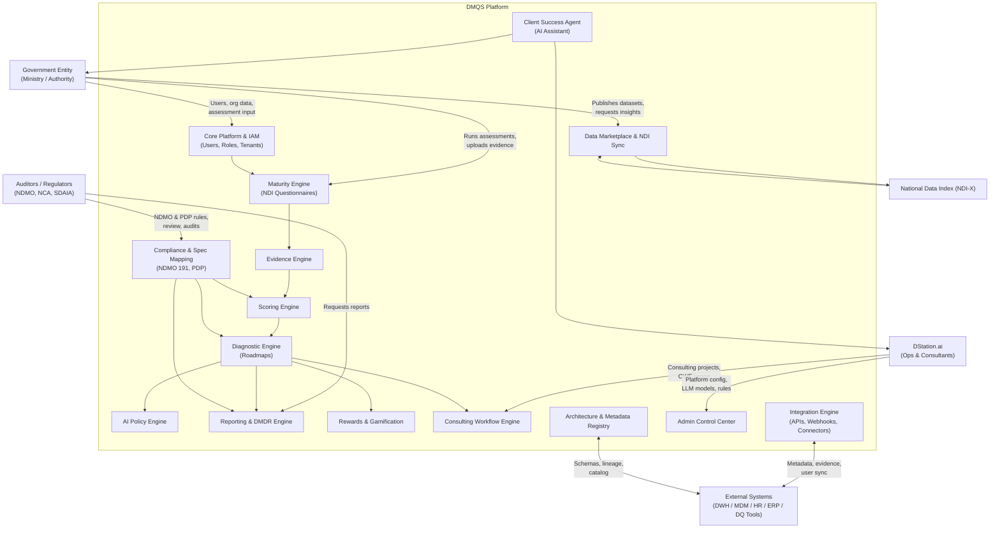
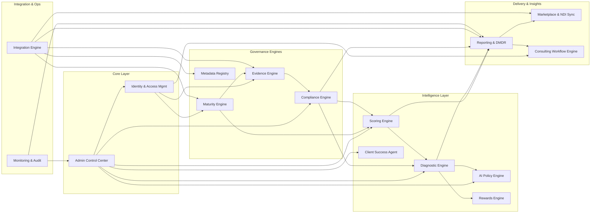
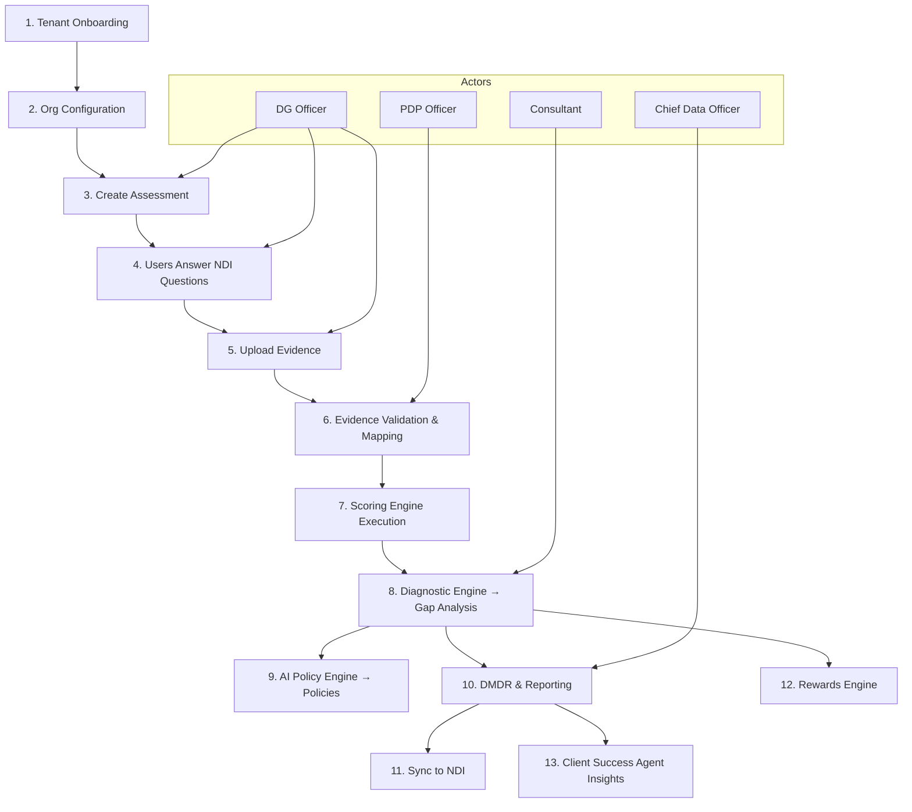
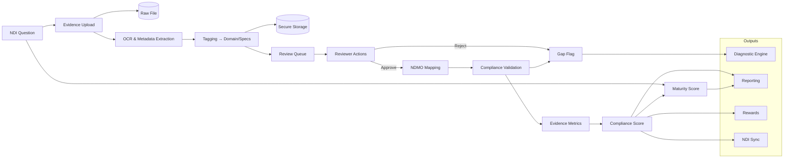
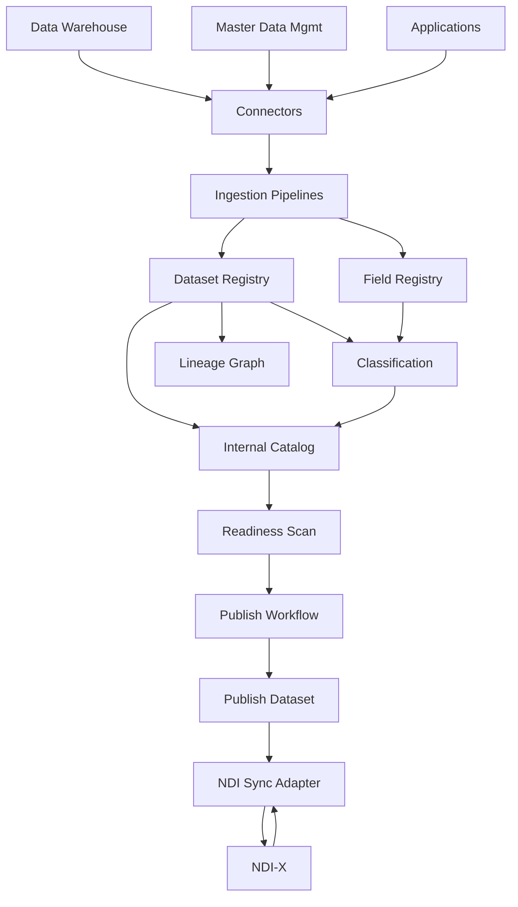

## DMQS / NDI End-to-End System Flow Diagrams (Comprehensive Markdown)

Below is the **full consolidated Markdown** containing all major DMQS flows:

* System Context (C0)
* Module Architecture (C1)
* End-to-End Assessment Flow
* Evidence → Compliance → Scoring Flow
* Marketplace & NDI Sync Flow
* Admin / Ops / AI Configuration Flow

All diagrams use **Mermaid**, ready for GitHub / GitLab / Obsidian / VSCode Mermaid preview.

---

# 1. System Context Diagram (C0 Level)



---

# 2. DMQS Module Architecture (C1 Level)



---

# 3. End-to-End Assessment → Evidence → Scoring → Roadmap Flow



---

# 4. Evidence → Compliance → Scoring Detailed Flow



---

# 5. Data Marketplace & NDI Sync Flow



---

# 6. Admin, Ops, AI Configuration Flow

```mermaid
flowchart LR
    subgraph ACC[Admin Control Center]
        TEN[Tenant Mgmt]
        RBAC[Roles & Permissions]
        RULES[Rule Libraries
        (NDMO, PDP, Mapping, Scoring)]
        AI_CONF[AI Config
        (Models, Prompts, Temp)]
        INT_CONF[Integration Config]
        MON[Monitoring & Audit]
    end

    subgraph Engines
        MAT[Maturity]
        EVI[Evidence]
        CMP[Compliance]
        SCO[Scoring]
        DIA[Diagnostic]
        POL[AI Policy]
        CSA[Client Success]
        REP[Reporting]
        MKT[Marketplace]
        INT[Integration]
        CWF[Consulting]
    end

    subgraph Actors
        SA[Super Admin]
        TA[Tenant Admin]
        CA[Compliance Admin]
        AIAI[AI Admin]
        OPS[Ops / SRE]
    end

    SA --> TEN
    TA --> RBAC
    CA --> RULES
    AIAI --> AI_CONF
    SA --> INT_CONF
    OPS --> MON

    TEN --> MAT
    TEN --> EVI
    TEN --> SCO
    TEN --> REP
    RBAC --> MAT
    RBAC --> EVI
    RBAC --> CMP
    RBAC --> SCO
    RBAC --> DIA
    RBAC --> CSA

    RULES --> CMP
    RULES --> SCO
    RULES --> DIA

    AI_CONF --> POL
    AI_CONF --> CSA
    AI_CONF --> DIA
    INT_CONF --> INT
    MON --> MAT
    MON --> EVI
    MON --> INT
```

---

## ✔ All diagrams included

## ✔ Fully structured Markdown

## ✔ Copy-paste ready for GitHub, Confluence, Notion, Obsidian, or render tools

If you'd like, I can also:

* Produce **high-resolution PNG exports** for each diagram
* Create a **C4 Model Package (C0–C4)**
* Generate a full **Architecture Deck (PPT / Keynote)**
* Add **sequence diagrams** for specific journeys (evidence, scoring, sync, etc.)

Just tell me what you want next. 🚀
